Spis treści

- [1. Złożoność czasowa i pamięciowa algorytmów](#1-złożoność-czasowa-i-pamięciowa-algorytmów)
  - [Co to jest złożoność algorytmu?](#co-to-jest-złożoność-algorytmu)
  - [Złożoność czasowa](#złożoność-czasowa)
  - [Złożoność pamięciowa](#złożoność-pamięciowa)
  - [Notacje asymptotyczne](#notacje-asymptotyczne)
    - [Formalne definicje matematyczne](#formalne-definicje-matematyczne)
    - [Przykładowe klasy złożoności](#przykładowe-klasy-złożoności)
    - [Pozostałe notacje złożoności](#pozostałe-notacje-złożoności)
- [2. Podstawowe struktury danych i algorytmy do ich przetwarzania](#2-podstawowe-struktury-danych-i-algorytmy-do-ich-przetwarzania)
  - [Co to jest struktura danych?](#co-to-jest-struktura-danych)
  - [Przykładowe struktury danych](#przykładowe-struktury-danych)
    - [Tablice (Arrays)](#tablice-arrays)
      - [Podstawowe operacje na tablicach](#podstawowe-operacje-na-tablicach)
      - [Algorytmy sortowania tablic](#algorytmy-sortowania-tablic)
  - [Lista powiązana, kolejka i Stos (Linked List, Queue, Stack)](#lista-powiązana-kolejka-i-stos-linked-list-queue-stack)
      - [Podstawowe operacje na kolejce i stosie (lista powiązana)](#podstawowe-operacje-na-kolejce-i-stosie-lista-powiązana)
      - [Algorytmy wykorzystujące powyższe struktury danych](#algorytmy-wykorzystujące-powyższe-struktury-danych)
    - [Grafy (Graphs)](#grafy-graphs)
      - [Reprezentacje grafów oraz złożoności operacji](#reprezentacje-grafów-oraz-złożoności-operacji)
      - [Algorytmy przeszukiwania grafów](#algorytmy-przeszukiwania-grafów)
- [3. Nowoczesne platformy programowania obiektowego](#3-nowoczesne-platformy-programowania-obiektowego)
  - [Co to programowanie obiektowe?](#co-to-programowanie-obiektowe)
  - [Główne cechy programowania obiektowego](#główne-cechy-programowania-obiektowego)
  - [Czym są nowoczesne platformy programowania obiektowego?](#czym-są-nowoczesne-platformy-programowania-obiektowego)
  - [Cechy nowoczesnych platform programowania obiektowego](#cechy-nowoczesnych-platform-programowania-obiektowego)
  - [Przykłady nowoczesnych platform programowania obiektowego](#przykłady-nowoczesnych-platform-programowania-obiektowego)
- [4. Porównanie sieci LAN i WAN](#4-porównanie-sieci-lan-i-wan)
  - [Co to sieć komputerowa?](#co-to-sieć-komputerowa)
  - [Definicje](#definicje)
  - [Porównanie LAN i WAN](#porównanie-lan-i-wan)
  - [Przykładowe zastosowania](#przykładowe-zastosowania)
- [5. Metody dostępu do medium transmisyjnego w lokalnych sieciach komputerowych](#5-metody-dostępu-do-medium-transmisyjnego-w-lokalnych-sieciach-komputerowych)
  - [Co to metody dostępu i po co są?](#co-to-metody-dostępu-i-po-co-są)
  - [Klasyfikacja metod dostępu](#klasyfikacja-metod-dostępu)
    - [Metody losowe](#metody-losowe)
      - [CSMA/CD (Carrier Sense Multiple Access with Collision Detection)](#csmacd-carrier-sense-multiple-access-with-collision-detection)
      - [CSMA/CA (Collision Avoidance)](#csmaca-collision-avoidance)
    - [Metody deterministyczne](#metody-deterministyczne)
      - [Token Passing](#token-passing)
      - [Time Division Multiple Access (TDMA)](#time-division-multiple-access-tdma)
  - [Współczesne sieci komputerowe](#współczesne-sieci-komputerowe)
- [6. Infrastruktura klucza publicznego – architektura oraz sposoby wykorzystania](#6-infrastruktura-klucza-publicznego--architektura-oraz-sposoby-wykorzystania)
  - [Czym jest infrastruktura klucza publicznego (PKI)?](#czym-jest-infrastruktura-klucza-publicznego-pki)
  - [Szyfrowanie asymetryczne](#szyfrowanie-asymetryczne)
  - [Elementy infrastruktury PKI](#elementy-infrastruktury-pki)
  - [Zastosowania PKI](#zastosowania-pki)
- [7. Podać różnice w implementacji obiektowości w kilku wybranych językach programowania](#7-podać-różnice-w-implementacji-obiektowości-w-kilku-wybranych-językach-programowania)
  - [Co to programowanie obiektowe?](#co-to-programowanie-obiektowe-1)
  - [Główne cechy programowania obiektowego](#główne-cechy-programowania-obiektowego-1)
  - [Implementacja obiektowości w wybranych językach programowania](#implementacja-obiektowości-w-wybranych-językach-programowania)
    - [Klasyczne języki OOP - Java, C#](#klasyczne-języki-oop---java-c)
      - [Charakterystyka](#charakterystyka)
      - [Dziedziczenie](#dziedziczenie)
      - [Wady i zalety](#wady-i-zalety)
    - [C++](#c)
      - [Charakterystyka](#charakterystyka-1)
      - [Dziedziczenie](#dziedziczenie-1)
      - [Wady i zalety](#wady-i-zalety-1)
    - [Python](#python)
      - [Charakterystyka](#charakterystyka-2)
      - [Dziedziczenie](#dziedziczenie-2)
      - [Wady i zalety](#wady-i-zalety-2)
    - [JavaScript (ES6+)](#javascript-es6)
      - [Charakterystyka](#charakterystyka-3)
      - [Dziedziczenie](#dziedziczenie-3)
      - [Wady i zalety](#wady-i-zalety-3)
    - [Zestawienie porównawcze](#zestawienie-porównawcze)
- [8. Cykle życia oprogramowania (modele wytwarzania oprogramowania)](#8-cykle-życia-oprogramowania-modele-wytwarzania-oprogramowania)
  - [Czym jest cykl życia oprogramowania?](#czym-jest-cykl-życia-oprogramowania)
  - [Klasyczne etapy cyklu życia oprogramowania](#klasyczne-etapy-cyklu-życia-oprogramowania)
  - [Popularne modele wytwarzania oprogramowania](#popularne-modele-wytwarzania-oprogramowania)
    - [Model kaskadowy (Waterfall)](#model-kaskadowy-waterfall)
      - [Zalety](#zalety)
      - [Wady](#wady)
      - [Zastosowanie](#zastosowanie)
    - [Model iteracyjny / przyrostowy](#model-iteracyjny--przyrostowy)
      - [Zalety](#zalety-1)
      - [Wady](#wady-1)
      - [Zastosowanie](#zastosowanie-1)
    - [Metody zwinne (Agile, Scrum)](#metody-zwinne-agile-scrum)
      - [Zalety](#zalety-2)
      - [Wady](#wady-2)
      - [Zastosowanie](#zastosowanie-2)
  - [Porównanie modeli](#porównanie-modeli)
- [9. Zasady modelowania dla konstrukcji relacyjnych baz danych](#9-zasady-modelowania-dla-konstrukcji-relacyjnych-baz-danych)
  - [Po co modelujemy bazy danych?](#po-co-modelujemy-bazy-danych)
  - [Etapy modelowania bazy danych](#etapy-modelowania-bazy-danych)
    - [Model pojęciowy – ERD (Entity-Relationship Diagram)](#model-pojęciowy--erd-entity-relationship-diagram)
      - [Encje](#encje)
      - [Atrybuty](#atrybuty)
      - [Relacje](#relacje)
  - [Klucze w relacyjnej bazie danych](#klucze-w-relacyjnej-bazie-danych)
  - [Normalizacja danych](#normalizacja-danych)
    - [Podstawowe postacie normalne (Normal Forms)](#podstawowe-postacie-normalne-normal-forms)
    - [Integralność danych](#integralność-danych)
    - [Dobre praktyki projektowe](#dobre-praktyki-projektowe)
- [10. Opis wybranej metodyki wytwarzania oprogramowania](#10-opis-wybranej-metodyki-wytwarzania-oprogramowania)
  - [Metodyka Scrum](#metodyka-scrum)
  - [Podstawowe założenia Scruma](#podstawowe-założenia-scruma)
  - [Role w Scrumie](#role-w-scrumie)
    - [Product Owner](#product-owner)
    - [Scrum Master](#scrum-master)
    - [Zespół deweloperski](#zespół-deweloperski)
  - [Artefakty Scruma](#artefakty-scruma)
    - [Product Backlog](#product-backlog)
    - [Sprint Backlog](#sprint-backlog)
    - [Increment (Przyrost)](#increment-przyrost)
  - [Ceremonie Scruma](#ceremonie-scruma)
    - [Sprint Planning](#sprint-planning)
    - [Daily Scrum](#daily-scrum)
    - [Sprint Review](#sprint-review)
    - [Sprint Retrospective](#sprint-retrospective)
  - [Schemat procesu Scrum](#schemat-procesu-scrum)
  - [Zalety i wady Scruma](#zalety-i-wady-scruma)
- [11. Rola i algorytmy mechanizmu szeregowania zadań w jądrze systemu operacyjnego.](#11-rola-i-algorytmy-mechanizmu-szeregowania-zadań-w-jądrze-systemu-operacyjnego)
  - [Czym jest szeregowanie zadań?](#czym-jest-szeregowanie-zadań)
  - [Rola mechanizmu szeregowania](#rola-mechanizmu-szeregowania)
  - [Stany procesów w OS](#stany-procesów-w-os)
  - [Wywłaszczenie](#wywłaszczenie)
  - [Algorytmy szeregowania zadań](#algorytmy-szeregowania-zadań)
    - [First-Come, First-Served (FCFS)](#first-come-first-served-fcfs)
    - [Shortest Job Next (SJN) / Shortest Remaining Time (SRT)](#shortest-job-next-sjn--shortest-remaining-time-srt)
    - [Round Robin (RR)](#round-robin-rr)
    - [Priority Scheduling](#priority-scheduling)
    - [Multilevel Queue Scheduling](#multilevel-queue-scheduling)
    - [Multilevel Feedback Queue](#multilevel-feedback-queue)
- [12. Modele barw w grafice komputerowej](#12-modele-barw-w-grafice-komputerowej)
  - [Czym jest model barw?](#czym-jest-model-barw)
  - [Postrzeganie jaśności](#postrzeganie-jaśności)
  - [Popularne modele barw](#popularne-modele-barw)
    - [Model RGB (Red, Green, Blue) - Addytywny](#model-rgb-red-green-blue---addytywny)
    - [Model CMY/CMYK (Cyan, Magenta, Yellow / Cyan, Magenta, Yellow, Key/Black) - Subtraktywny](#model-cmycmyk-cyan-magenta-yellow--cyan-magenta-yellow-keyblack---subtraktywny)
    - [Model HSL/HSV (Hue, Saturation, Lightness / Value)](#model-hslhsv-hue-saturation-lightness--value)
    - [YCbCr - Model używany w telewizji i kompresji wideo.](#ycbcr---model-używany-w-telewizji-i-kompresji-wideo)
  - [Porównanie modeli barw](#porównanie-modeli-barw)
  - [Konwersja modeli barw](#konwersja-modeli-barw)
- [13. Poziomy testowania w cyklu życia oprogramowania](#13-poziomy-testowania-w-cyklu-życia-oprogramowania)
  - [Czym są poziomy testowania?](#czym-są-poziomy-testowania)
  - [Główne poziomy testowania](#główne-poziomy-testowania)
    - [Testy jednostkowe (Unit Testing)](#testy-jednostkowe-unit-testing)
    - [Testy integracyjne (Integration Testing)](#testy-integracyjne-integration-testing)
    - [Testy systemowe (System Testing)](#testy-systemowe-system-testing)
    - [Testy akceptacyjne (Acceptance Testing)](#testy-akceptacyjne-acceptance-testing)
- [14. Klasy języków programowania na wybranych przykładach](#14-klasy-języków-programowania-na-wybranych-przykładach)
  - [Po co klasyfikujemy języki?](#po-co-klasyfikujemy-języki)
  - [Klasyfikacja języków programowania](#klasyfikacja-języków-programowania)
    - [Paradygmat programowania](#paradygmat-programowania)
    - [Poziom abstrakcji](#poziom-abstrakcji)
    - [Typowanie](#typowanie)
    - [Sposób wykonania](#sposób-wykonania)
    - [Zestawienie zbiorcze](#zestawienie-zbiorcze)
- [15. Zasady budowy interfejsów użytkownika systemów informatycznych](#15-zasady-budowy-interfejsów-użytkownika-systemów-informatycznych)
  - [Czym jest interfejs użytkownika?](#czym-jest-interfejs-użytkownika)
  - [Użyteczność jako podstawa (Usability)](#użyteczność-jako-podstawa-usability)
  - [Podstawowe zasady projektowania UI](#podstawowe-zasady-projektowania-ui)
    - [Prostota i minimalizm](#prostota-i-minimalizm)
    - [Spójność](#spójność)
    - [Widoczność stanu systemu](#widoczność-stanu-systemu)
    - [Informacja zwrotna (feedback)](#informacja-zwrotna-feedback)
    - [Zapobieganie błędom](#zapobieganie-błędom)
    - [Dostępność (Accessibility)](#dostępność-accessibility)
    - [Ergonomia i projektowanie pod użytkownika](#ergonomia-i-projektowanie-pod-użytkownika)
- [16. Techniki komunikacji międzyprocesowej](#16-techniki-komunikacji-międzyprocesowej)
  - [Czym jest IPC (Inter-Process Communication)?](#czym-jest-ipc-inter-process-communication)
  - [Główne cele IPC](#główne-cele-ipc)
  - [Podział technik IPC](#podział-technik-ipc)
  - [Mechanizmy oparte na przesyłaniu komunikatów](#mechanizmy-oparte-na-przesyłaniu-komunikatów)
    - [Potoki (Pipes)](#potoki-pipes)
    - [Kolejki komunikatów (Message Queues)](#kolejki-komunikatów-message-queues)
    - [Gniazda (Sockets)](#gniazda-sockets)
  - [Mechanizmy oparte na współdzieleniu pamięci](#mechanizmy-oparte-na-współdzieleniu-pamięci)
    - [Pamięć współdzielona (Shared Memory)](#pamięć-współdzielona-shared-memory)
  - [Mechanizmy synchronizacji](#mechanizmy-synchronizacji)
    - [Semafory](#semafory)
    - [Muteksy (Mutexes)](#muteksy-mutexes)
    - [Zdarzenia (Events)](#zdarzenia-events)
  - [Tabelka porównawcza](#tabelka-porównawcza)
- [17. Główne techniki zwiększania wydajności współczesnych procesorów](#17-główne-techniki-zwiększania-wydajności-współczesnych-procesorów)
  - [Dlaczego wydajność procesorów wspólcześnie optymalizujemy inaczej niż kiedyś?](#dlaczego-wydajność-procesorów-wspólcześnie-optymalizujemy-inaczej-niż-kiedyś)
  - [Główne techniki zwiększania wydajności procesorów](#główne-techniki-zwiększania-wydajności-procesorów)
    - [Potokowanie instrukcji (Pipeline)](#potokowanie-instrukcji-pipeline)
    - [Superskalarność](#superskalarność)
    - [Wykonywanie poza kolejnością (Out-of-Order Execution)](#wykonywanie-poza-kolejnością-out-of-order-execution)
    - [Pamięć podręczna (Cache)](#pamięć-podręczna-cache)
    - [Przewidywanie skoków (Branch Prediction)](#przewidywanie-skoków-branch-prediction)
    - [Wielordzeniowość i wielowątkowość](#wielordzeniowość-i-wielowątkowość)
      - [Wielordzeniowość (Multi-core)](#wielordzeniowość-multi-core)
      - [Wielowątkowość sprzętowa (SMT / Hyper-Threading)](#wielowątkowość-sprzętowa-smt--hyper-threading)
  - [Tabelka podsumowująca](#tabelka-podsumowująca)
- [18. Charakterystyka modeli przetwarzania w Internecie](#18-charakterystyka-modeli-przetwarzania-w-internecie)
  - [Czym są modele przetwarzania?](#czym-są-modele-przetwarzania)
  - [Model klient–serwer](#model-klientserwer)
  - [Model peer-to-peer (P2P)](#model-peer-to-peer-p2p)
  - [Model chmury obliczeniowej (Cloud Computing)](#model-chmury-obliczeniowej-cloud-computing)
  - [Model edge computing](#model-edge-computing)
  - [Porównanie modeli](#porównanie-modeli-1)
  - [Obecne trendy](#obecne-trendy)
- [19. Otwarte systemy agentowe: definicja, problemy konstrukcyjne i metody ich rozwiązywania](#19-otwarte-systemy-agentowe-definicja-problemy-konstrukcyjne-i-metody-ich-rozwiązywania)
  - [Definicja systemu agentowego](#definicja-systemu-agentowego)
  - [Cechy agentów](#cechy-agentów)
  - [Czym są otwarte systemy agentowe?](#czym-są-otwarte-systemy-agentowe)
  - [Charakterystyka otwartych systemów agentowych](#charakterystyka-otwartych-systemów-agentowych)
  - [Główne problemy konstrukcyjne](#główne-problemy-konstrukcyjne)
    - [Koordynacja agentów](#koordynacja-agentów)
    - [Komunikacja między agentami](#komunikacja-między-agentami)
    - [Bezpieczeństwo i zaufanie](#bezpieczeństwo-i-zaufanie)
    - [Skalowalność](#skalowalność)
    - [Konflikty i sprzeczne cele](#konflikty-i-sprzeczne-cele)
  - [Tabela podsumowująca problemy i rozwiązania](#tabela-podsumowująca-problemy-i-rozwiązania)
- [20. Metody pozyskiwania danych przestrzennych](#20-metody-pozyskiwania-danych-przestrzennych)
  - [Czym są dane przestrzenne?](#czym-są-dane-przestrzenne)
  - [Główne klasy metod pozyskiwania danych](#główne-klasy-metod-pozyskiwania-danych)
  - [Metody bezpośrednie – pomiary terenowe](#metody-bezpośrednie--pomiary-terenowe)
  - [Systemy GNSS / GPS](#systemy-gnss--gps)
  - [Fotogrametria](#fotogrametria)
  - [Metody teledetekcyjne](#metody-teledetekcyjne)
    - [Skaning laserowy (LiDAR)](#skaning-laserowy-lidar)
    - [Fotografia satelitarna](#fotografia-satelitarna)
  - [Dane wtórne i digitalizacja](#dane-wtórne-i-digitalizacja)
  - [Tabela porównawcza](#tabela-porównawcza)
  - [Współczesne systemy GIS](#współczesne-systemy-gis)
- [21. Metody klasyfikacji obrazów satelitarnych](#21-metody-klasyfikacji-obrazów-satelitarnych)
  - [Czym jest klasyfikacja obrazu?](#czym-jest-klasyfikacja-obrazu)
  - [Cele klasyfikacji](#cele-klasyfikacji)
  - [Podstawowy podział metod klasyfikacji](#podstawowy-podział-metod-klasyfikacji)
  - [Klasyfikacja nienadzorowana](#klasyfikacja-nienadzorowana)
  - [Klasyfikacja nadzorowana](#klasyfikacja-nadzorowana)
  - [Klasyfikacja obiektowa](#klasyfikacja-obiektowa)
  - [Metody oparte na uczeniu maszynowym](#metody-oparte-na-uczeniu-maszynowym)
  - [Tabela porównawcza metod klasyfikacji](#tabela-porównawcza-metod-klasyfikacji)
  - [Ocena jakości klasyfikacji](#ocena-jakości-klasyfikacji)
- [22. Zastosowania formalizmu i metod teorii grafów](#22-zastosowania-formalizmu-i-metod-teorii-grafów)
  - [Czym jest formalizm grafowy?](#czym-jest-formalizm-grafowy)
  - [Podstawowe typy grafów](#podstawowe-typy-grafów)
  - [Zastosowania teorii grafów](#zastosowania-teorii-grafów)
    - [Sieci Komputerowe](#sieci-komputerowe)
  - [Nawigacja](#nawigacja)
  - [Optymalizacja ruchu drogowego](#optymalizacja-ruchu-drogowego)
  - [Optymalizacja tras i logistyka](#optymalizacja-tras-i-logistyka)
  - [Modelowanie relacji społecznych](#modelowanie-relacji-społecznych)
  - [Edytory grafowe](#edytory-grafowe)
    - [Wizualizacja przepywu pracy](#wizualizacja-przepywu-pracy)
    - [Wizualizacja przepływu danych](#wizualizacja-przepływu-danych)
    - [Low-Code, No-Code](#low-code-no-code)
    - [Algorytmy](#algorytmy)
- [23. Paradygmat programowania strukturalnego](#23-paradygmat-programowania-strukturalnego)
  - [Czym jest programowanie strukturalne?](#czym-jest-programowanie-strukturalne)
  - [Programowanie imperatywne vs strukturalne](#programowanie-imperatywne-vs-strukturalne)
    - [Programowanie imperatywne](#programowanie-imperatywne)
    - [Programowanie strukturalne](#programowanie-strukturalne)
    - [Najważniejsza różnica](#najważniejsza-różnica)
  - [Cechy charakterystyczne paradygmatu](#cechy-charakterystyczne-paradygmatu)
  - [Przykładowe języki strukturalne](#przykładowe-języki-strukturalne)
  - [Przykładowy schemat programu strukturalnego:](#przykładowy-schemat-programu-strukturalnego)
  - [Zalety i wady](#zalety-i-wady)
- [24. Metody kompresji stratnej obrazów i dźwięku](#24-metody-kompresji-stratnej-obrazów-i-dźwięku)
  - [Czym jest kompresja stratna?](#czym-jest-kompresja-stratna)
  - [Ograniczenia percepcji człowieka](#ograniczenia-percepcji-człowieka)
    - [Wzrok](#wzrok)
    - [Słuch](#słuch)
  - [Metody kompresji stratnej obrazów (na przykładzie JPEG)](#metody-kompresji-stratnej-obrazów-na-przykładzie-jpeg)
    - [1. Konwersja kolorów](#1-konwersja-kolorów)
    - [2. Próbkowanie chrominancji](#2-próbkowanie-chrominancji)
    - [3. Podział na bloki](#3-podział-na-bloki)
    - [4. Transformacja kosinusowa (DCT)](#4-transformacja-kosinusowa-dct)
    - [5. Kwantyzacja](#5-kwantyzacja)
    - [6. Kodowanie entropijne](#6-kodowanie-entropijne)
    - [Efekty uboczne kompresji obrazu](#efekty-uboczne-kompresji-obrazu)
  - [Kompresja stratna dźwięku (MP3, AAC)](#kompresja-stratna-dźwięku-mp3-aac)
    - [1. Podział na ramki (kwantyzacja czasowa)](#1-podział-na-ramki-kwantyzacja-czasowa)
    - [2. Transformacja Fouriera (FFT)](#2-transformacja-fouriera-fft)
    - [3. Maskowanie psychoakustyczne](#3-maskowanie-psychoakustyczne)
    - [4. Redukcja precyzji](#4-redukcja-precyzji)
    - [5. Kodowanie entropijne](#5-kodowanie-entropijne)
  - [Efekty uboczne kompresji dźwięku](#efekty-uboczne-kompresji-dźwięku)
  - [Przykłady formatów](#przykłady-formatów)
  - [Porównanie obraz vs dźwięk](#porównanie-obraz-vs-dźwięk)
  - [Zalety i wady kompresji stratnej](#zalety-i-wady-kompresji-stratnej)
- [25. Rodzaje filtrów oraz ich zastosowanie w przetwarzaniu obrazów](#25-rodzaje-filtrów-oraz-ich-zastosowanie-w-przetwarzaniu-obrazów)
  - [Czym jest filtr obrazu?](#czym-jest-filtr-obrazu)
  - [Rodzaje filtrów](#rodzaje-filtrów)
  - [Filtry liniowe](#filtry-liniowe)
    - [Dolnoprzepustowe](#dolnoprzepustowe)
    - [Górnoprzepustowe](#górnoprzepustowe)
  - [Filtry nieliniowe](#filtry-nieliniowe)
    - [Filtr medianowy](#filtr-medianowy)
    - [Filtr morfologiczny](#filtr-morfologiczny)
  - [Filtry specjalistyczne](#filtry-specjalistyczne)
    - [Filtr Sobela](#filtr-sobela)
    - [Filtr Laplace'a](#filtr-laplacea)
    - [Morfologia matematyczna](#morfologia-matematyczna)
  - [Filtry w dziedzinie częstotliwości](#filtry-w-dziedzinie-częstotliwości)
  - [Zastosowania filtrów](#zastosowania-filtrów)
  - [Tabelka porównawcza](#tabelka-porównawcza-1)

# 1. Złożoność czasowa i pamięciowa algorytmów

## Co to jest złożoność algorytmu?

Złożoność algorytmu pozwala ocenić zużycie zasobów (czas, pamięć) oraz jego wzrost w zależności od rozmiaru danych wejściowych.

Jest to analiza czysto teoretyczna, nie insteresuje nas faktyczny czas wykonania na konkretnym urządzeniu, tylko sam algorytm oraz jego zachowanie w zależności od danych wejściowych.

## Złożoność czasowa

Złożoność czasowa określa liczbę operacji wykonywanych przez algorytm jako funkcję rozmiaru danych wejściowych (n).

W przypadku większej ilości danych wejściowych niezależnie wpływających na czas wykonania, złożoność czasowa jest sumą złożoności poszczególnych części.

_**Przykładowo:** Dla grafu z n wierzchołkami i m krawędziami, złożoność czasowa algorytmu DFS wynosi O(n + m)._

## Złożoność pamięciowa

Złożoność pamięciowa określa ilość pamięci potrzebnej do wykonania algorytmu jako funkcję rozmiaru danych wejściowych (n).

Najczęściej bardziej optymalny czasowo algorytm czasowo będzie miał gorszą złożoność pamięciową i odwrotnie.

_**Przykładowo:** Algorytm sortowania przez scalanie (Merge Sort) ma złożoność pamięciową O(n) i czasową O(n log n) ze względu na potrzebę dodatkowej pamięci do przechowywania podtablic._

_Natomiast algorytm sortowania bąbelkowego (Bubble Sort) ma złożoność pamięciową O(1) i czasową O(n^2), ponieważ działa bez dodatkowej pamięci, ale jest mniej efektywny czasowo._

## Notacje asymptotyczne

Złożoność czasową wyraża się za pomocą notacji asymptotycznych stosowanych do opisu zarówno złożoności czasowej, jak i pamięciowej algorytmów.

| Notacja        | Opis                                                   | Przykład |
| -------------- | ------------------------------------------------------ | -------- |
| O (duże O)     | Górna granica złożoności, funkcja ograniczająca z góry | O(n)     |
| Ω (duże Omega) | Dolna granica złożoności, funkcja ograniczająca z dołu | Ω(n)     |
| Θ (duże Theta) | Dokładna złożoność                                     | Θ(n)     |

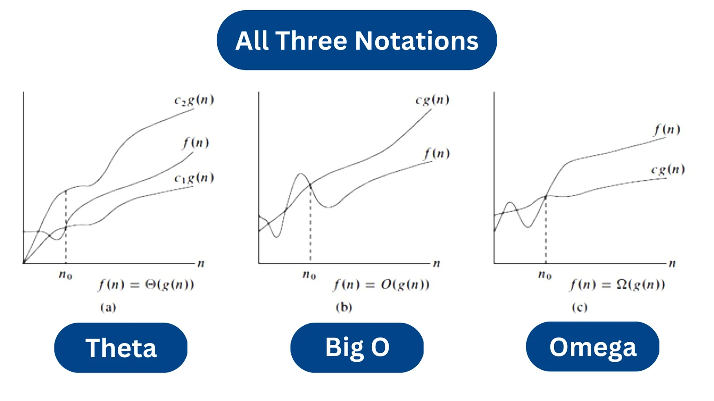

Najczęściej używaną notacją jest O.

### Formalne definicje matematyczne

**W przypadku notacji O**
$$f(n) = O(g(n))$$
istnieją stałe
$$c > 0, \quad n_0 \geq 0$$
takie że dla każdego
$$n \geq n_0$$
spełniona jest nierówność
$$0 \leq f(n) \leq c \cdot g(n)$$
lub dla psychopatów od dyskretnej

$$
\exists c > 0, \exists n_0 \geq 0, \forall n \geq n_0 : 0 \leq f(n) \leq c \cdot g(n)
$$

**Analogiczne dla Ω**

$$
f(n) = \Omega(g(n))
$$

Przy identycznych założeniach spełniona jest nierówność

$$
0 \leq c \cdot g(n) \leq f(n)
$$

**Oraz po połączeniu powyższych nierówności dla Θ**

$$
f(n) = \Theta(g(n))
$$

Ponownie przy identycznych założeniach spełniona jest nierówność

$$
0 \leq c \cdot g(n) \leq f(n) \leq c \cdot g(n)
$$

### Przykładowe klasy złożoności

| Klasa złożoności | Opis                  | Przykład algorytmu                 |
| ---------------- | --------------------- | ---------------------------------- |
| O(1)             | Stała                 | Dostęp do elementu tablicy         |
| O(log n)         | Logarytmiczna         | Wyszukiwanie binarne               |
| O(n)             | Liniowa               | Przeszukiwanie liniowe             |
| O(n log n)       | Liniowo-logarytmiczna | Sortowanie szybkie (Quicksort)     |
| O(n^2)           | Kwadratowa            | Sortowanie bąbelkowe (Bubble Sort) |
| O(2^n)           | Wykładnicza           | Problem komiwojażera (brute force) |

### Pozostałe notacje złożoności

_Ciekawostka, do pominęcia przy egzaminie_

**Małe o (little o)**
$$f(n) = o(g(n))$$
oznacza, że
$$\lim_{n \to \infty} \frac{f(n)}{g(n)} = 0$$

Czyli funkcja f(n) rośnie wolniej niż g(n).

**Małe omega (little ω)**
$$f(n) = \omega(g(n))$$
oznacza, że

$$
\lim_{n \to \infty} \frac{f(n)}{g(n)} = \infty
$$

Czyli funkcja f(n) rośnie szybciej niż g(n).

# 2. Podstawowe struktury danych i algorytmy do ich przetwarzania

## Co to jest struktura danych?

Struktura danych to sposób organizacji i przechowywania danych w pamięci komputera, umożliwiający efektywne wykonywanie operacji na tych danych.

Każda struktura danych ma swoje zalety i wady, a jej wybór ma kluczowe znaczenie dla wydajności algorytmów.

_**Przykładowo:** Graf może być reprezentowany za pomocą m.in. listy sąsiedztwa lub macierzy sąsiedztwa, lista sąsiedztwa jest bardziej efektywna pamięciowo dla rzadkich grafów i umożliwia szybsze dodawanie krawędzi. Natomiast macierz sąsiedztwa jest bardziej efektywna dla gęstych grafów i umożliwia szybkie sprawdzanie istnienia krawędzi._

## Przykładowe struktury danych

### Tablice (Arrays)

Tablice to podstawowa struktura danych, która przechowuje elementy w sposób ciągły w pamięci. Umożliwiają szybki dostęp do elementów za pomocą indeksów.

#### Podstawowe operacje na tablicach

| operacja   | złożoność czasowa |
| ---------- | ----------------- |
| Dostęp     | O(1)              |
| Zmiana     | O(1)              |
| Wstawianie | O(n)              |
| Usuwanie   | O(n)              |

#### Algorytmy sortowania tablic

| Zmienna | Opis                                                            |
| ------- | --------------------------------------------------------------- |
| n       | liczba elementów w tablicy                                      |
| k       | zakres wartości elementów (np. dla liczb całkowitych od 0 do k) |

| Algorytm                           | Złożoność czasowa | Złożoność pamięciowa |
| ---------------------------------- | ----------------- | -------------------- |
| Sortowanie bąbelkowe (Bubble Sort) | O(n^2)            | O(1)                 |
| Sortowanie kubelkowe (Bucket Sort) | O(n + k)          | O(n + k)             |
| Sortowanie szybkie (Quick Sort)    | O(n log n)        | O(log n)             |

## Lista powiązana, kolejka i Stos (Linked List, Queue, Stack)

Lista powiązana to struktura danych składająca się z węzłów, gdzie każdy węzeł zawiera dane oraz wskaźnik do następnego (i opcjonalnie poprzedniego) węzła.

Lista powiązana umożliwia dynamiczne zarządzanie pamięcią oraz efektywne wstawianie i usuwanie elementów. Wykorzystuje się ją do implementacji innych struktur danych, takich jak kolejki i stosy.

Kolejka to struktura danych działająca na zasadzie FIFO (First In, First Out), gdzie elementy są dodawane na końcu i usuwane z początku.

Stos to struktura danych działająca na zasadzie LIFO (Last In, First Out), gdzie elementy są dodawane i usuwane z tego samego końca.

Najefektywniejsze w przypadku wykonywania prostych operacji implementacje prostej kolejki (bez priorytetów) i stosu to lista powiązana.

#### Podstawowe operacje na kolejce i stosie (lista powiązana)

| operacja  | złożoność czasowa |
| --------- | ----------------- |
| Dodanie   | O(1)              |
| Usunięcie | O(1)              |
| Podgląd   | O(1)              |

#### Algorytmy wykorzystujące powyższe struktury danych

| Algorytm                    | Struktura danych    | Złożoność czasowa | Złożoność pamięciowa |
| --------------------------- | ------------------- | ----------------- | -------------------- |
| Przeszukiwanie wszerz (BFS) | Kolejka             | O(V + E)          | O(V)                 |
| Przeszukiwanie w głąb (DFS) | Stos lub rekurencja | O(V + E)          | O(V)                 |

### Grafy (Graphs)

Grafy to struktury danych składające się z wierzchołków i krawędzi (połączeń) między nimi.

Mogą być skierowane lub nieskierowane, ważone lub nieważone.

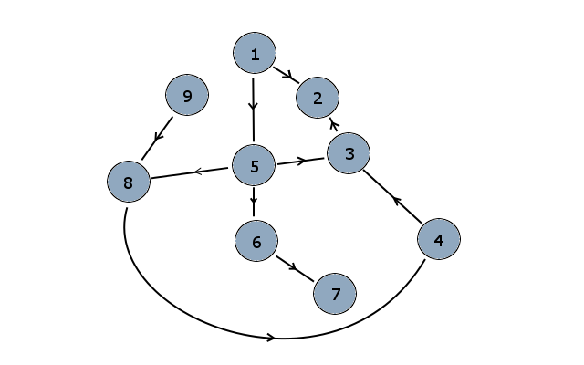

#### Reprezentacje grafów oraz złożoności operacji

| Zmienna | Opis                         |
| ------- | ---------------------------- |
| V       | liczba wierzchołków w grafie |
| E       | liczba krawędzi w grafie     |

| Reprezentacja      | Dodawanie wierzchołka | Dodawanie krawędzi | Sprawdzanie istnienia krawędzi |
| ------------------ | --------------------- | ------------------ | ------------------------------ |
| Macierz sąsiedztwa | O(1)                  | O(1)               | O(1)                           |
| Lista sąsiedztwa   | O(1)                  | O(1)               | O(deg(v))                      |
| Lista krawędzi     | O(1)                  | O(1)               | O(E)                           |

#### Algorytmy przeszukiwania grafów

| Algorytm                    | Złożoność czasowa | Złożoność pamięciowa |
| --------------------------- | ----------------- | -------------------- |
| Przeszukiwanie wszerz (BFS) | O(V + E)          | O(V)                 |
| Przeszukiwanie w głąb (DFS) | O(V + E)          | O(V)                 |

# 3. Nowoczesne platformy programowania obiektowego

## Co to programowanie obiektowe?

Programowanie obiektowe (OOP) to paradygmat programowania, który organizuje kod wokół obiektów, które łączą dane i zachowania (metody) operujące na tych danych.

## Główne cechy programowania obiektowego

| Cecha         | Opis                                                                                   |
| ------------- | -------------------------------------------------------------------------------------- |
| Abstrakcja    | Ukrywanie złożoności poprzez definiowanie interfejsów i klas.                          |
| Enkapsulacja  | Ograniczanie dostępu do danych wewnątrz obiektu.                                       |
| Dziedziczenie | Tworzenie nowych klas na podstawie istniejących, dziedzicząc ich właściwości i metody. |
| Polimorfizm   | Możliwość używania jednej metody w różnych kontekstach                                 |

## Czym są nowoczesne platformy programowania obiektowego?

Nowoczesne platformy programowania obiektowego to nie tylko języki, ale całe środowiska i frameworki, które wspierają rozwój aplikacji w paradygmacie OOP, oferując narzędzia, biblioteki i mechanizmy ułatwiające tworzenie, testowanie i wdrażanie oprogramowania.

Ponadto nowoczesne platformy często integrują się z innymi technologiami, takimi jak bazy danych (ORM), usługi webowe czy narzędzia do zarządzania wersjami. Oraz posiadają wsparcie dla wzorców projektowych, takich jak MVC, Dependency Injection czy Repository Pattern, które pomagają w organizacji kodu i utrzymaniu jego jakości.

## Cechy nowoczesnych platform programowania obiektowego

| Cecha                       | Opis                                                                            |
| --------------------------- | ------------------------------------------------------------------------------- |
| Modularność i skalowalność  | Podział aplikacji na moduły i komponenty, ułatwiający utrzymanie i rozwój kodu. |
| Zarządzanie pamięcią        | Automatyczny garbage collector zmniejsza ryzyko wycieków pamięci.               |
| Wsparcie dla współbieżności | Mechanizmy do zarządzania wątkami i programowania asynchronicznego.             |
| Integracja z architekturami | Wsparcie dla wzorców takich jak MVC, mikroserwisy i REST API.                   |

## Przykłady nowoczesnych platform programowania obiektowego

| Platforma  | Cechy                                                                                                                                                                                                                             |
| ---------- | --------------------------------------------------------------------------------------------------------------------------------------------------------------------------------------------------------------------------------- |
| .NET (C#)  | Bardzo dobra integracja z systemem Windows, silne wsparcie dla aplikacji webowych i desktopowych                                                                                                                                  |
| JVM (Java) | Write once, run anywhere - możliwość uruchamiania aplikacji na różnych platformach bez konieczności rekompilacji dzięki uruchamianiu na maszynie wirtualnej JVM, Możliwość tworzenia aplikacji webowych, desktopowych i mobilnych |
| Python     | Wszechstronny język z silnym wsparciem dla OOP, szerokie zastosowanie w nauce danych, sztucznej inteligencji, aplikacjach webowych i automatyzacji. Cechuje się typowaniem dynamicznym.                                           |

# 4. Porównanie sieci LAN i WAN

## Co to sieć komputerowa?

Sieć komputerowa to zbiór połączonych ze sobą urządzeń (komputerów, serwerów, routerów itp.), które umożliwiają wymianę danych i zasobów między nimi.

Sieci komputerowe można klasyfikować na różne sposoby

| Kryterium           | Przykłady                      |
| ------------------- | ------------------------------ |
| Zasięg geograficzny | LAN, WAN, MAN                  |
| Topologia           | Gwiazda, magistrala, pierścień |
| Technologia         | Ethernet, Wi-Fi, Bluetooth     |
| Model komunikacji   | Klient-serwer, peer-to-peer    |

## Definicje

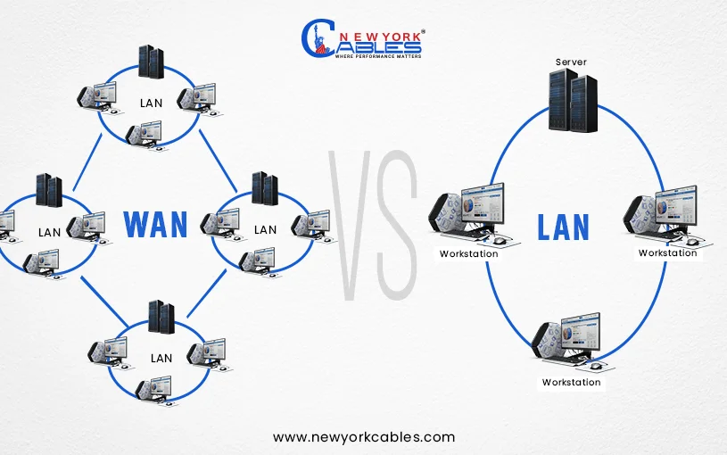

- **LAN (Local Area Network)**: Sieć komputerowa obejmująca niewielki obszar geograficzny, taki jak dom, biuro czy kampus. Charakteryzuje się wysoką prędkością transmisji danych i niskimi opóźnieniami.
- **WAN (Wide Area Network)**: Sieć komputerowa obejmująca rozległy obszar geograficzny (miasto, kraj, kontynent), często łącząca wiele sieci LAN. Charakteryzuje się niższą prędkością transmisji danych i większymi opóźnieniami w porównaniu do LAN.

## Porównanie LAN i WAN

| Cecha          | LAN               | WAN              |
| -------------- | ----------------- | ---------------- |
| Zasięg         | lokalny           | globalny         |
| Prędkość       | bardzo wysoka     | niższa           |
| Opóźnienia     | niskie            | wysokie          |
| Koszt          | niski             | wysoki           |
| Własność       | jedna organizacja | wielu operatorów |
| Bezpieczeństwo | łatwiejsze        | bardziej złożone |

## Przykładowe zastosowania

| LAN                                             | WAN                                 |
| ----------------------------------------------- | ----------------------------------- |
| Połączenie komputerów w biurze czy laboratorium | Eduroam                             |
| Udostępnianie zasobów lokalnych                 | Dostęp do Internetu                 |
| Gry sieciowe lokalne                            | Komunikacja między oddziałami firmy |

# 5. Metody dostępu do medium transmisyjnego w lokalnych sieciach komputerowych

## Co to metody dostępu i po co są?

W sieciach lokalnych wiele urządzeń współdzieli jedno medium transmisyjne (np. kabel, fale radiowe).

Jak zapobiec sytuacji, w której kilka stacji nadaje jednocześnie?

Rozwiązaniem są metody dostępu do medium, które:

- regulują kolejność transmisji,
- minimalizują kolizje,
- zwiększają wydajność sieci.

## Klasyfikacja metod dostępu

Podstawowym podziałem metod dostępu jest podział na deterministyczne i niedeterministyczne (losowe).

### Metody losowe

Stacje same decydują, kiedy nadawać

#### CSMA/CD (Carrier Sense Multiple Access with Collision Detection)

1. Stacje nasłuchują medium przed nadawaniem.
2. Jeśli medium jest wolne, stacja rozpoczyna transmisję.
3. Jeśli wykryta zostanie kolizja, stacja przerywa transmisję i ponawia ją po losowym czasie.

Metoda ta była stosowana w klasycznym Ethernet (half-duplex), kolizje są wykrywane ale nie zapobiegane. Nie jest stosowana w nowoczesnych sieciach Ethernet (full-duplex).

#### CSMA/CA (Collision Avoidance)

1. Stacje nasłuchują medium przed nadawaniem.
2. Jeśli medium jest wolne, stacja wysyła sygnał rezerwacji (RTS).
3. Odbiorca odpowiada sygnałem potwierdzenia (CTS).
4. Stacja może rozpocząć transmisję po otrzymaniu CTS.

Metoda ta jest stosowana w sieciach bezprzewodowych (Wi-Fi), gdzie wykrywanie kolizji jest trudne.

### Metody deterministyczne

Stacje mają przydzielony czas lub kolejkę do nadawania

#### Token Passing

1. Stacje są połączone w pierścień.
2. Tylko stacja posiadająca token może nadawać.
3. Po zakończeniu transmisji token jest przekazywany do następnej stacji.

Była wykorzystywana w sieciach Token Ring i FDDI.

#### Time Division Multiple Access (TDMA)

1. Czas transmisji jest podzielony na sloty czasowe.
2. Każda stacja ma przydzielony slot czasowy do nadawania
3. Stacje mogą nadawać tylko w swoich slotach czasowych

Metody te są stosowane w sieciach o wysokiej jakości usług (QoS) i gwarantowanym czasie transmisji.

## Współczesne sieci komputerowe

Nowoczesne sieci Ethernet działają w trybie full-duplec, co eliminuje kolizje i sprawia, że metody dostępu takie jak CSMA/CD nie są już potrzebne.

W sieciach bezprzewodowych Wi-Fi kluczowym problemem nie są kolizje ramek, lecz interferencja sygnałów radiowych, dlatego poza odpowiednim przydzielaniem kanałów stosuje się metody unikania kolizji, takie jak CSMA/CA.

# 6. Infrastruktura klucza publicznego – architektura oraz sposoby wykorzystania

## Czym jest infrastruktura klucza publicznego (PKI)?

Infrastruktura klucza publicznego (PKI) to zbiór technologii, procedur i polityk służących do zarządzania kluczami kryptograficznymi oraz certyfikatami cyfrowymi, które umożliwiają bezpieczną komunikację i uwierzytelnianie w sieciach komputerowych.

## Szyfrowanie asymetryczne

Szyfrowanie asymetryczne wykorzystuje parę kluczy: klucz publiczny i klucz prywatny. Klucz publiczny jest udostępniany innym użytkownikom, podczas gdy klucz prywatny jest przechowywany w tajemnicy przez właściciela.

Wiadomość zaszyfrowana kluczem publicznym może być odszyfrowana tylko za pomocą odpowiadającego klucza prywatnego i odwrotnie. Co umożliwia bezpieczną wymianę informacji, uwierzytelnianie nadawcy oraz zapewnienie integralności danych.

## Elementy infrastruktury PKI

PKI to nie tylko same certyfikaty i klucze, ale cały system zarządzający cyklem życia certyfikatów od generowania kluczy i wystawianie certyfikatów, przez ich dystrybucję, weryfikację, aż po unieważnianie i odnowienie.

| Element                 | Funkcja                                                                            |
| ----------------------- | ---------------------------------------------------------------------------------- |
| Urząd certyfikacji (CA) | Wystawia i podpisuje certyfikaty, potwierdza tożsamość podmiotów.                  |
| Urząd rejestracji (RA)  | Weryfikuje tożsamość użytkowników przed wystawieniem certyfikatów.                 |
| Certyfikat cyfrowy      | Dokument elektroniczny łączący tożsamość z kluczem publicznym, podpisany przez CA. |
| Repozytorium            | Przechowuje certyfikaty i listy unieważnień (CRL).                                 |

## Zastosowania PKI

- **TLS/SSL** - PKI jest podstawą protokołów TLS/SSL, które zabezpieczają komunikację w Internecie, zapewniając poufność, integralność i uwierzytelnianie stron.
- **Szyfrowanie e-maili** - PKI umożliwia bezpieczne przesyłanie wiadomości e-mail poprzez szyfrowanie i podpisy cyfrowe (np. S/MIME).
- **Podpisy cyfrowe** - Podpisy cyfrowe wykorzystują PKI do uwierzytelniania dokumentów elektronicznych (np. mObywatel), zapewniając, że pochodzą od określonego nadawcy i nie zostały zmienione.

# 7. Podać różnice w implementacji obiektowości w kilku wybranych językach programowania

## Co to programowanie obiektowe?

Programowanie obiektowe (OOP) to paradygmat programowania, który organizuje kod wokół obiektów, które łączą dane i zachowania (metody) operujące na tych danych.

## Główne cechy programowania obiektowego

| Cecha         | Opis                                                                                   |
| ------------- | -------------------------------------------------------------------------------------- |
| Abstrakcja    | Ukrywanie złożoności poprzez definiowanie interfejsów i klas.                          |
| Enkapsulacja  | Ograniczanie dostępu do danych wewnątrz obiektu.                                       |
| Dziedziczenie | Tworzenie nowych klas na podstawie istniejących, dziedzicząc ich właściwości i metody. |
| Polimorfizm   | Możliwość używania jednej metody w różnych kontekstach                                 |

## Implementacja obiektowości w wybranych językach programowania

### Klasyczne języki OOP - Java, C#

#### Charakterystyka

- silne, statyczne typowanie,
- wszystko (prawie) jest obiektem,
- klasy są podstawową jednostką abstrakcji.
- Garbage collection.

#### Dziedziczenie

- pojedyncze dziedziczenie klas,
- wielokrotność realizowana przez interfejsy.

#### Wady i zalety

| Zalety                             | Wady                                                                                |
| ---------------------------------- | ----------------------------------------------------------------------------------- |
| Bezpieczeństwo i czytelność kodu   | Nadmiarowość kodu (bo wszystko jest klasą lub obiektem)                             |
| Łatwość utrzymania dużych systemów | Ograniczenia dziedziczenia (brak wielokrotnego) - realizowane za pomocą interfejsów |

### C++

#### Charakterystyka

- wspiera zarówno programowanie proceduralne, jak i obiektowe,
- zarządzanie pamięcią manualne (brak garbage collection),
- wsparcie dla programowania niskopoziomowego.

#### Dziedziczenie

- wielokrotne dziedziczenie klas - możliwy problem diamentu,
- wsparcie dla klas wirtualnych (pełniących rolę interfejsów).

#### Wady i zalety

| Zalety                          | Wady                                                     |
| ------------------------------- | -------------------------------------------------------- |
| Wysoka wydajność                | Złożoność zarządzania pamięcią (brak garbage collection) |
| Elastyczność w podejściu do OOP | Problemy z wielokrotnym dziedziczeniem (diament)         |

### Python

#### Charakterystyka

- dynamiczne typowanie,
- wszystko jest obiektem,
- prosta składnia i czytelność kodu.

#### Dziedziczenie

- wielokrotne dziedziczenie klas - bez problemu diamentu dzięki metodzie rozwiązywania konfliktów (MRO).

#### Wady i zalety

| Zalety                 | Wady                                    |
| ---------------------- | --------------------------------------- |
| Szybkie prototypowanie | Brak kontroli typów w czasie kompilacji |
| Czytelność kodu        | Potencjalnie więcej błędów w runtime    |

### JavaScript (ES6+)

#### Charakterystyka

- prototypowe dziedziczenie,
- dynamiczne typowanie,
- od ES6 dostępna składnia class (efektywnie funkcja budująca prototypy).

#### Dziedziczenie

- prototypowe dziedziczenie - obiekty dziedziczą bezpośrednio z innych obiektów,
- dziedziczenie wielokrotne poprzez łańcuchy prototypów, brak możliwości klasycznego wielokrotnego dziedziczenia.
- brak klasycznych klas (choć składnia class w ES6+ ułatwia tworzenie obiektów).

#### Wady i zalety

| Zalety                     | Wady                                      |
| -------------------------- | ----------------------------------------- |
| Elastyczność i lekkość     | Brak tradycyjnych klas może być mylący    |
| Szybkie tworzenie obiektów | Problemy z zarządzaniem kontekstem (this) |

### Zestawienie porównawcze

| Cecha          | Java / C#  | C++         | Python      | JavaScript    |
| -------------- | ---------- | ----------- | ----------- | ------------- |
| Typowanie      | statyczne  | statyczne   | dynamiczne  | dynamiczne    |
| Dziedziczenie  | pojedyncze | wielokrotne | wielokrotne | prototypowe   |
| GC             | tak        | nie         | tak         | tak           |
| Elastyczność   | średnia    | niska       | wysoka      | bardzo wysoka |
| Bezpieczeństwo | wysokie    | średnie     | niższe      | niższe        |

# 8. Cykle życia oprogramowania (modele wytwarzania oprogramowania)

## Czym jest cykl życia oprogramowania?

Cykl życia oprogramowania (Software Development Life Cycle, SDLC) to strukturalne podejście do tworzenia oprogramowania, obejmujące wszystkie etapy od początkowej koncepcji aż po wdrożenie i utrzymanie. Celem modeli wytwarzania oprogramowania jest uporządkowanie procesu, redukcja ryzyka, poprawa jakości końcowego produktu.

## Klasyczne etapy cyklu życia oprogramowania

1. Analiza wymagań
2. Projektowanie
3. Implementacja
4. Testowanie
5. Wdrożenie
6. Utrzymanie

## Popularne modele wytwarzania oprogramowania

### Model kaskadowy (Waterfall)

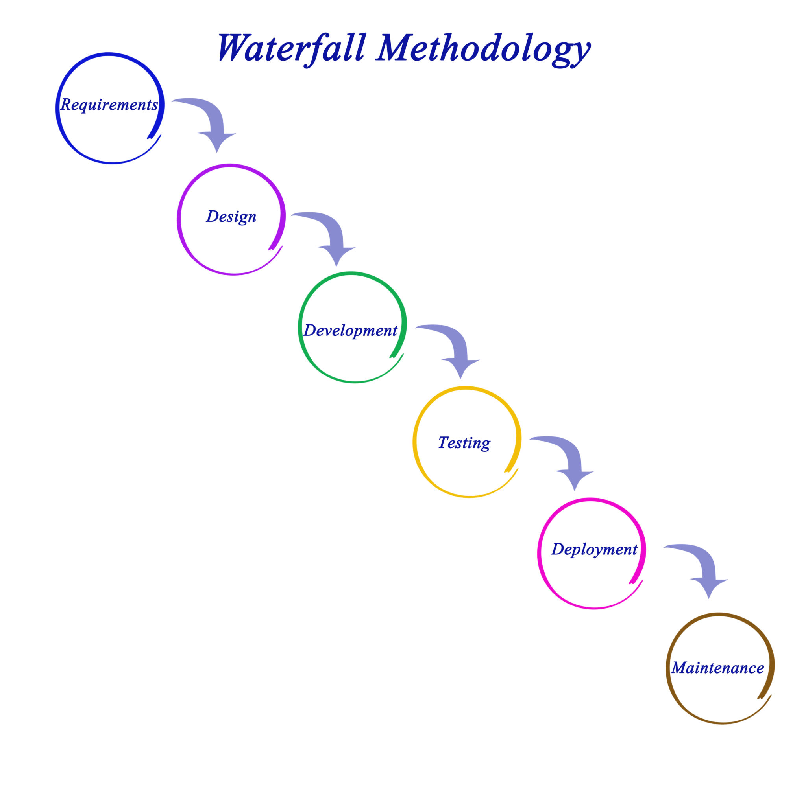

1. Sekwencyjny proces, gdzie każdy etap musi być zakończony przed rozpoczęciem następnego.
2. Łatwy do zrozumienia i zarządzania.
3. Ograniczona elastyczność, trudności w adaptacji do zmian wymagań.

#### Zalety

- prosty i czytelny
- dobra dokumentacja
- łatwy do zarządzania.

#### Wady

- brak elastyczności
- trudne wprowadzanie zmian
- ryzykowny przy niepełnych wymaganiach

#### Zastosowanie

Projekty z jasno określonymi wymaganiami.

### Model iteracyjny / przyrostowy

```
Iteration 1: Plan → Design → Develop → Test → Working Increment v1.0
                                                         ↓
Iteration 2: Plan → Design → Develop → Test → Working Increment v1.1
                                                         ↓
Iteration 3: Plan → Design → Develop → Test → Working Increment v1.2
                                                         ↓
                                      ... Continue until complete ...
                                                         ↓
Final Product: Fully functional software meeting all requirements
```

1. System powstaje stopniowo
2. Każda iteracja dostarcza działający fragment
3. Umożliwia wczesne wykrywanie błędów i adaptację do zmian wymagań.

#### Zalety

- szybsze wykrywanie błędów
- możliwość reagowania na zmiany
- wcześniejsze wersje produktu

#### Wady

- trudniejsze planowanie
- większa złożoność zarządzania

#### Zastosowanie

Projekty z niejasnymi lub zmieniającymi się wymaganiami.

### Metody zwinne (Agile, Scrum)

1. krótkie iteracje (sprinty)
2. stała współpraca z klientem
3. szybka reakcja na zmiany

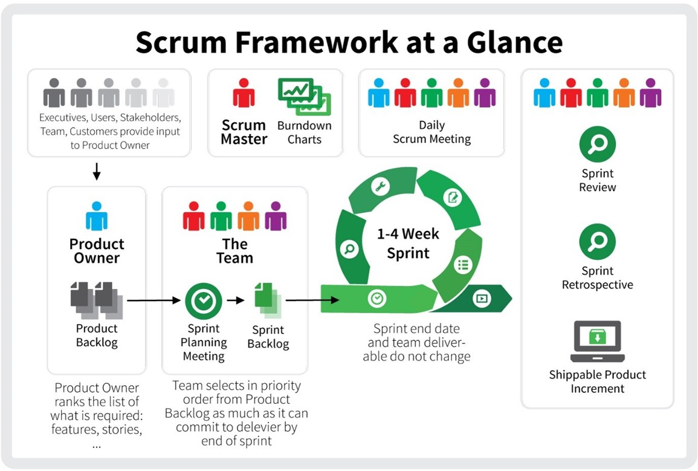

#### Zalety

- wysoka elastyczność
- szybkie dostarczanie wartości
- dobra komunikacja.

#### Wady

- wymaga zaangażowania klienta
- trudne do skalowania w dużych zespołach
- mniejsza przewidywalność harmonogramu

#### Zastosowanie

Projekty wymagające dużej elastyczności i szybkiego dostarczania wartości o zmiennych lub nieprecyzyjnych wymaganiach.

## Porównanie modeli

| Model      | Elastyczność | Ryzyko  | Dokumentacja |
| ---------- | ------------ | ------- | ------------ |
| Kaskadowy  | niska        | wysokie | wysoka       |
| Iteracyjny | średnia      | średnie | średnia      |
| Zwinny     | wysoka       | niskie  | niska        |

# 9. Zasady modelowania dla konstrukcji relacyjnych baz danych

## Po co modelujemy bazy danych?

Modelowanie relacyjnej bazy danych to proces projektowania struktury danych w taki sposób aby

- dane były spójne i jednoznaczne
- zminimalizować redundancję
- uniknąć anomalii operacji
- zapewnić łatwość utrzymania i rozwoju systemu

Modelowanie odbywa się przed implementacją SQL.

## Etapy modelowania bazy danych

Wyróżniamy trzy główne etapy:

- Model pojęciowy – ERD (encje, atrybuty, relacje)
- Model logiczny – tabele, klucze, zależności
- Model fizyczny – implementacja w DBMS (typy danych, indeksy)

### Model pojęciowy – ERD (Entity-Relationship Diagram)

Podstawowe elementy

#### Encje

Obiekty świata rzeczywistego (np. Student, Kurs),

W przypadku relacyjnej bazy danych tabele.

#### Atrybuty

Cechy encji (np. imię, numer_indeksu),

w bazie kolumny.

#### Relacje

Powiązania między encjami, określane przez krotności:

- 1:1
- 1:N
- N:M

Relacja N:M wymaga tabeli pośredniej (asocjacyjnej).

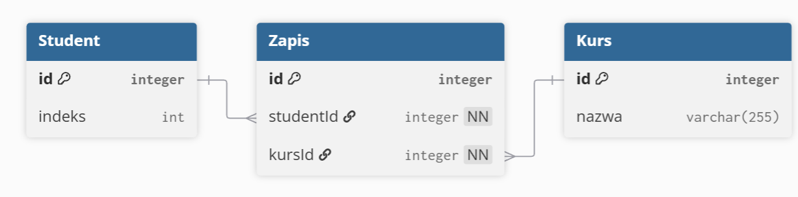

## Klucze w relacyjnej bazie danych

Rodzaje kluczy

- klucz główny (PRIMARY KEY) – jednoznaczna identyfikacja rekordu

- klucz obcy (FOREIGN KEY) – powiązanie z inną tabelą

- klucz złożony – kilka kolumn jako identyfikator

**Każda tabela musi mieć klucz główny.**

## Normalizacja danych

Cel normalizacji

- eliminacja redundancji
- zapobieganie anomaliom
  - wstawiania
  - aktualizacji
  - usuwania

### Podstawowe postacie normalne (Normal Forms)

| Postać  | Opis                         |
| ------- | ---------------------------- |
| **1NF** | wartości atomowe             |
| **2NF** | brak zależności częściowych  |
| **3NF** | brak zależności przechodnich |

### Integralność danych

Zasady zapewniające spójność danych w bazie:

- integralność encji – klucz główny nie może być NULL
- integralność referencyjna – klucz obcy musi istnieć w tabeli nadrzędnej
- integralność dziedzinowa – wartości muszą być zgodne z określonymi typami i zakresami
- ograniczenia unikalności – wartości muszą być unikalne

### Dobre praktyki projektowe

- Unikać danych powtarzalnych
- Stosować jednoznaczne nazwy tabel i kolumn
- Rozdzielać dane logicznie niezależne
- Projektować strukturę pod zapytania i rozwój systemu.

# 10. Opis wybranej metodyki wytwarzania oprogramowania

## Metodyka Scrum

Scrum to zwinna metodyka wytwarzania oprogramowania, należąca do rodziny Agile, której celem jest:

- szybkie dostarczanie wartości biznesowej
- elastyczne reagowanie na zmiany wymagań
- ścisła współpraca zespołu z klientem

## Podstawowe założenia Scruma

Scrum zakłada, że wymagania mogą się zmieniać w trakcie projektu.

Scrum opiera się na

- iteracyjności – praca w sprintach (standardowo 2 tygodnie)
- przyrostowości – każdy sprint dostarcza działający fragment systemu
- transparentności – jawność postępów
- inspekcji i adaptacji – ciągłe doskonalenie, dostosowywanie systemu w trakcie pracy

## Role w Scrumie

### Product Owner

Reprezentuje interesy klienta, zarządza backlogiem produktu oraz priorytetami funkcji.

### Scrum Master

Facylitator zespołu, dba o przestrzeganie zasad Scruma, usuwa przeszkody i wspiera zespół w efektywnej pracy.

### Zespół deweloperski

Samozarządzający się zespół odpowiedzialny za dostarczanie działającego oprogramowania w każdym sprincie.

## Artefakty Scruma

### Product Backlog

Lista wymagań i funkcjonalności, uporządkowana według priorytetów.

### Sprint Backlog

Elementy wybrane do sprintu, plan realizacji sprintu.

### Increment (Przyrost)

Działająca część systemu, spełniająca Definition of Done.

## Ceremonie Scruma

### Sprint Planning

Planowanie sprintu, wybór zadań z backlogu do realizacji w sprincie.

### Daily Scrum

Codzienne, krótkie spotkanie zespołu, omówienie postępów i przeszkód.

### Sprint Review

Prezentacja wyników sprintu interesariuszom, zbieranie feedbacku.

### Sprint Retrospective

Analiza procesu pracy, identyfikacja usprawnień na przyszłość.

## Schemat procesu Scrum

```
Product Backlog → Sprint Planning → Daily Scrum → Sprint Review → Sprint Retrospective → (repeat)
```

## Zalety i wady Scruma

Zalety

- szybka reakcja na zmiany
- częsty feedback
- wysoka jakość dzięki iteracjom
- dobra komunikacja zespołu

Wady

- trudny do skalowania
- wymaga doświadczonego zespołu
- wymaga dużego zaangażowania klienta (oraz gotowości do billingu za godziny pracy zamiast fixed price)
- mniej formalnej dokumentacji

# 11. Rola i algorytmy mechanizmu szeregowania zadań w jądrze systemu operacyjnego.

## Czym jest szeregowanie zadań?

Szeregowanie zadań (CPU scheduling) to mechanizm jądra systemu operacyjnego, który

- decyduje który proces lub wątek otrzyma procesor
- kiedy i na jak długo będzie wykonywany

Ponieważ CPU jest zasobem współdzielonym, konieczne jest sprawiedliwe, wydajne i responsywne przydzielanie czasu procesora.

## Rola mechanizmu szeregowania

Mechanizm szeregowania w jądrze OS odpowiada za

- Maksymalne wykorzystanie CPU,
- minimalizację czasu oczekiwania procesów,
- szybkie reakcje systemu (responsywność),
- obsługę wielu procesów jednocześnie (wielozadaniowość),
- realizację priorytetów procesów.

przełączanie kontekstu (context switch) – zapis i odtworzenie stanu procesu.

## Stany procesów w OS

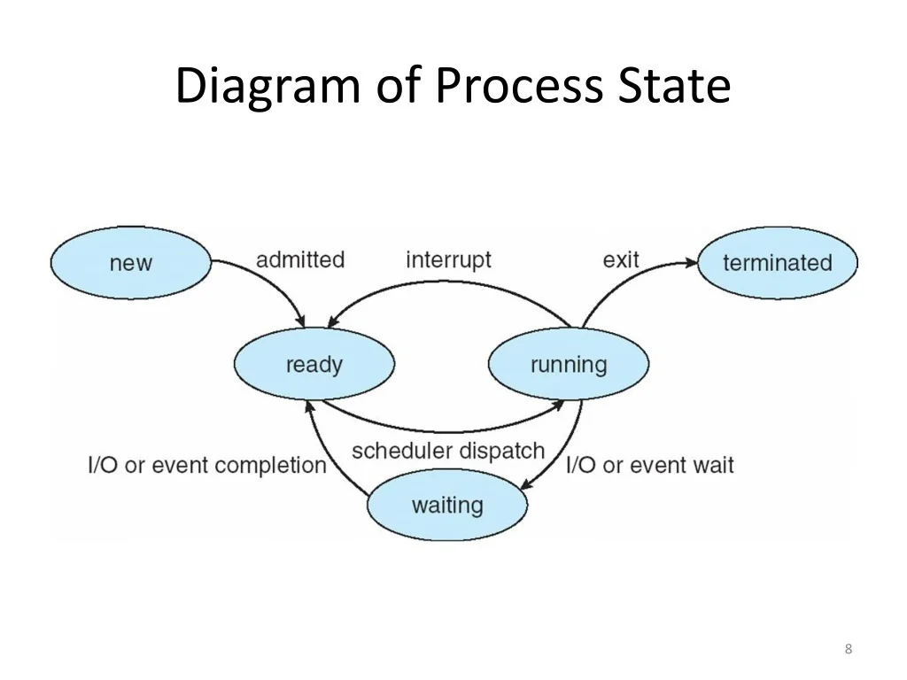

Procesy mogą znajdować się w następujących stanach:

- ready – gotowy do wykonania,
- running – aktualnie wykonywany,
- waiting – oczekuje na zasób I/O lub zdarzenie,
- terminated – zakończony.

Procesy w stanie ready trafiają do kolejek szeregowania.

## Wywłaszczenie

Algorytmy szeregowania można podzielić na:

niewywłaszczające – proces sam oddaje CPU (np. FCFS),
wywłaszczające – OS może przerwać proces (np. RR).

## Algorytmy szeregowania zadań

### First-Come, First-Served (FCFS)

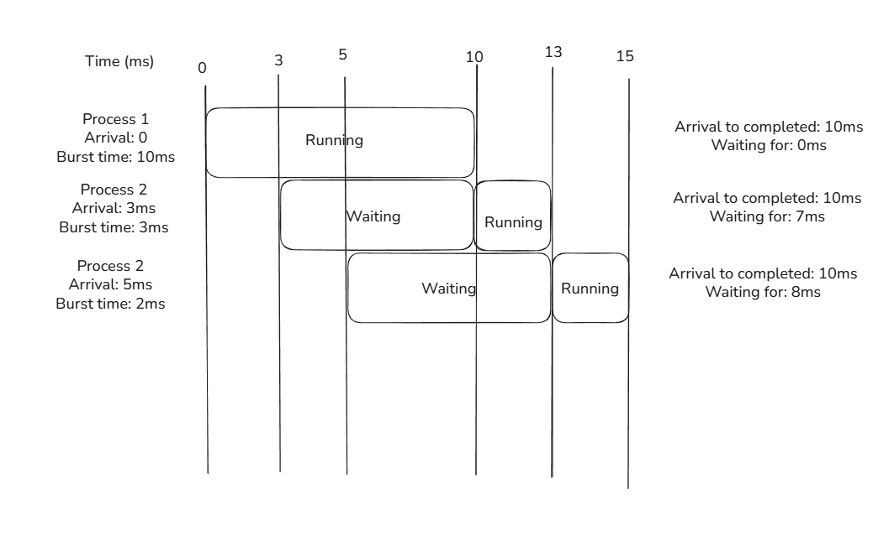

Procesy wykonywane w kolejności zgłoszeń.

Cechy:

- bardzo prosty w implementacji
- brak wywłaszczania

Wada:
Efekt „konwoju” (długi proces blokuje krótsze).

### Shortest Job Next (SJN) / Shortest Remaining Time (SRT)

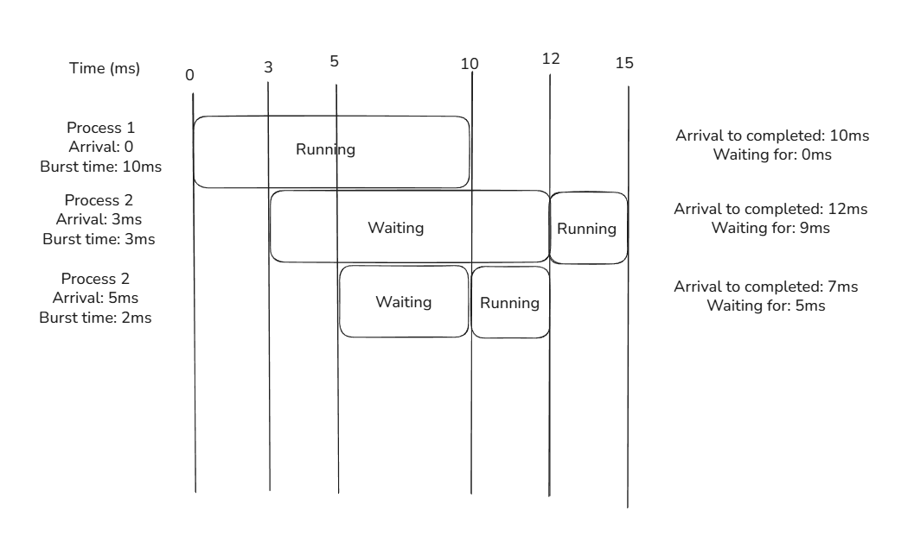

Procesy z najkrótszym czasem wykonania mają pierwszeństwo.

Cechy:

- minimalizuje średni czas oczekiwania

Wada:

- wymaga znajomości czasu wykonania (trudne do przewidzenia)
- ryzyko zagłodzenia długich procesów

### Round Robin (RR)

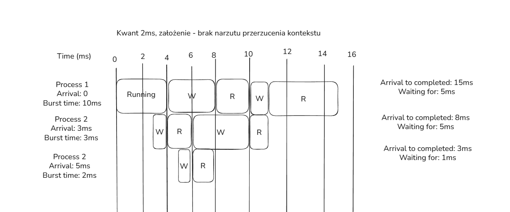

Każdy proces dostaje kwant czasu, po jego upływie następuje wywłaszczenie.

Cechy:

- sprawiedliwy podział czasu CPU
- dobra responsywność

Działanie zależne od długości kwantu czasu:

- zbyt krótki kwant zwiększa narzut przełączania kontekstu
- zbyt długi kwant zmniejsza responsywność

### Priority Scheduling

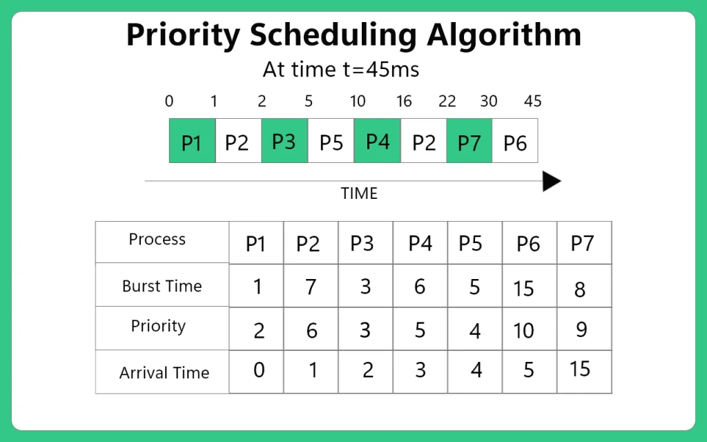

Procesy mają przypisane priorytety; wyższy priorytet oznacza pierwszeństwo.

Cechy:

- umożliwia realizację ważniejszych zadań
  Wady:
- ryzyko zagłodzenia procesów o niskim priorytecie
- może wymagać mechanizmu podnoszenia priorytetów (aging)

### Multilevel Queue Scheduling

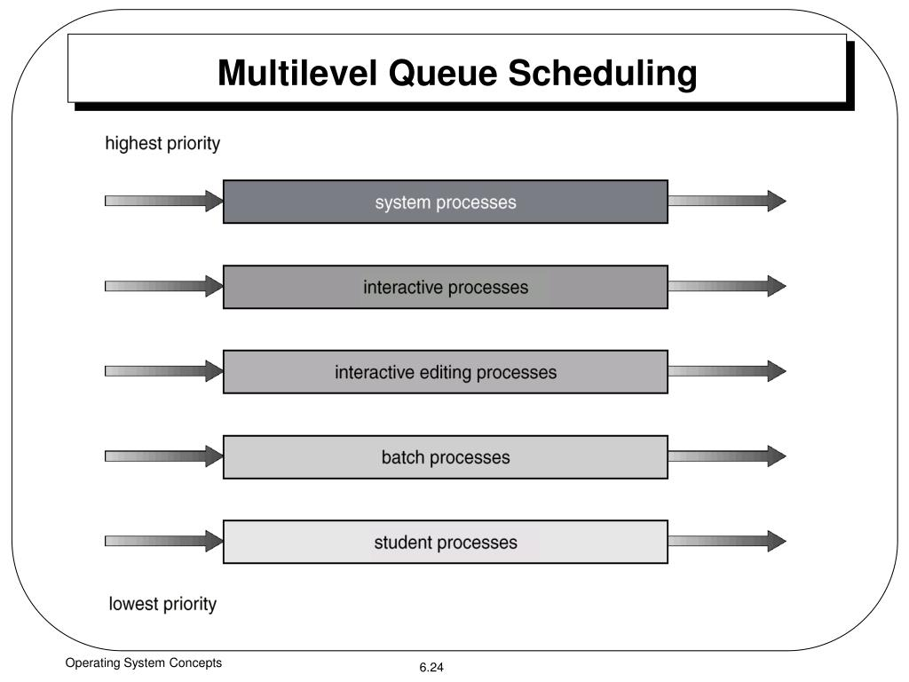

Procesy są podzielone na różne kolejki według kategorii (np. interaktywne, wsadowe).

Każda kolejka może mieć własny algorytm szeregowania np. RR dla interaktywnych, FCFS dla wsadowych.

Cechy:

- umożliwia różne polityki dla różnych typów procesów
  Wady:
- złożoność zarządzania kolejkami

### Multilevel Feedback Queue

Procesy mogą zmieniać kolejki w zależności od ich zachowania (np. czas CPU, oczekiwanie na I/O).
Cechy:

- adaptacyjność do zachowania procesów
  Wady:
- złożoność implementacji i zarządzania

# 12. Modele barw w grafice komputerowej

## Czym jest model barw?

Model barw to matematyczny sposób opisu koloru za pomocą liczb, umożliwiający reprezentację kolorów w systemach komputerowych, zależy od urządzenia lub sposobu percepcji.

Różne modele barw są używane w różnych kontekstach, takich jak wyświetlanie na ekranie, drukowanie czy przetwarzanie obrazów.

## Postrzeganie jaśności

Korzystając z funkcji luminancji, można obliczyć postrzeganie jasność koloru na podstawie jego składowych RGB.

$$
f(r, g, b) = \frac{\sqrt{0.299 \cdot r^2 + 0.587 \cdot g^2 + 0.114 \cdot b^2}}{255}
$$

Przy założeniu nasycenia 50% oraz pozycji hue od 0 do 360 stopni na osi x wzór przekształca się do:

$$
f(h) = \frac{\sqrt{0.299 \cdot r(hsl(h, 100, 50))^2 + 0.587 \cdot g(hsl(h, 100, 50))^2 + 0.114 \cdot b(hsl(h, 100, 50))^2}}{255}
$$

wykres ten wygląda mniej więcej tak:

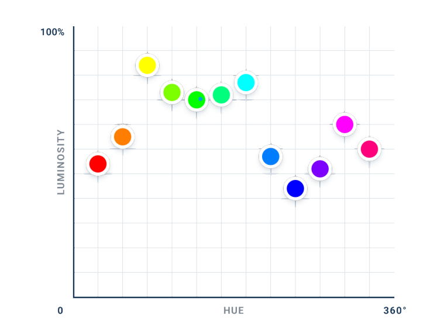

Jeżeli zwrócimy uwagę na minima i maksima lokalne tej funkcji, zauważymy, że:

- Minima lokalne występują dla czerwonego, zielonego i niebieskiego (stąd model RGB)
- Maksima lokalne występują dla kolorów czerwonego, cyan i magenta (stąd model CMY)

## Popularne modele barw

### Model RGB (Red, Green, Blue) - Addytywny

- Addytywny model barw używany w wyświetlaczach elektronicznych.
- Kolory tworzone przez mieszanie czerwonego, zielonego i niebieskiego światła.
- Każda składowa ma wartość od 0 do 255.
- 0,0,0 to czarny, 255,255,255 to biały.

### Model CMY/CMYK (Cyan, Magenta, Yellow / Cyan, Magenta, Yellow, Key/Black) - Subtraktywny

- Subtraktywny model barw używany w druku.
- Kolory tworzone przez mieszanie cyjanu, magenty i żółtego
- CMYK dodaje czarny (Key) dla lepszej głębi i oszczędności tuszu.
- 0,0,0 to biały, 255,255,255 to czarny.

### Model HSL/HSV (Hue, Saturation, Lightness / Value)

- Modele oparte na percepcji ludzkiego oka.
- Hue (odcień) określa kolor (0-360 stopni),
- Saturation (nasycenie) określa intensywność koloru (0-100%),
- Lightness/Value (jasność/wartość) określa jasność koloru (0-100%).

Lub alternatywny, lepiej zachowujący kolory przy wyższej jasności:

OKLCH - (Lightness, Chroma, hue)

### YCbCr - Model używany w telewizji i kompresji wideo.

- Y (luminancja) reprezentuje jasność,
- Cb i Cr (chrominancja) reprezentują informacje o kolorze.
- Umożliwia efektywną kompresję danych wideo.

## Porównanie modeli barw

| Model   | Typ          | Zastosowanie |
| ------- | ------------ | ------------ |
| RGB     | addytywny    | ekrany       |
| CMYK    | subtraktywny | druk         |
| HSV/HSL | percepcyjny  | edycja       |
| YCbCr   | luminancja   | wideo        |

## Konwersja modeli barw

Konwersja między modelami barw jest często wymagana w grafice komputerowej i przetwarzaniu obrazów, lecz nie jest ona bezstratna i może prowadzić do utraty jakości.

# 13. Poziomy testowania w cyklu życia oprogramowania

## Czym są poziomy testowania?

Testowanie oprogramowania to proces weryfikacji i walidacji systemu w celu:

- wykrycia błędów,
- sprawdzenia zgodności z wymaganiami,
- zapewnienia jakości produktu.

Poziomy testowania określają, na jakim etapie i na jakim poziomie szczegółowości testujemy system.

## Główne poziomy testowania

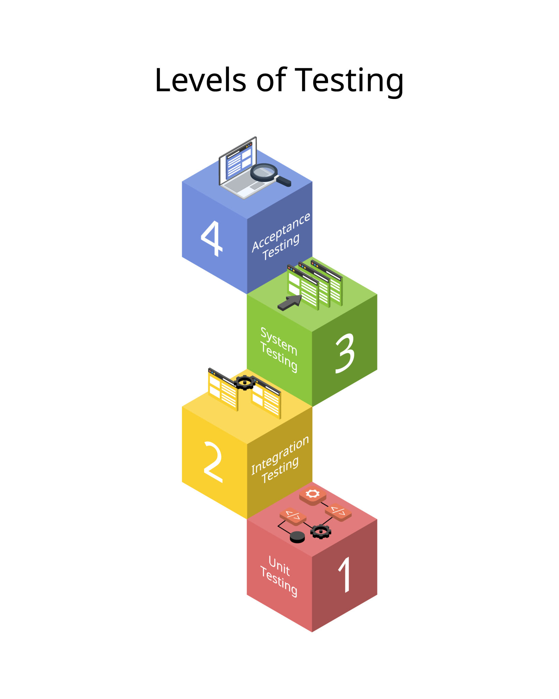

### Testy jednostkowe (Unit Testing)

- Testowanie pojedynczych modułów lub funkcji.
- Celem jest weryfikacja poprawności działania najmniejszych jednostek kodu.
- Zazwyczaj wykonywane przez programistów.
- Szybkie i tanie do automatyzacji.

Narzędzia: JUnit (Java), pytest (Python), NUnit (C#), Jest (JavaScript).

### Testy integracyjne (Integration Testing)

- Testowanie współdziałania między modułami lub komponentami.
- Celem jest wykrycie błędów w interakcjach i w przepływie danych między modułami.
- Może być wykonywane przez programistów lub testerów.

Narzędzia: Zazwyczaj wspólne dla testów jednostkowych.

### Testy systemowe (System Testing)

- Testowanie całego systemu jako całości.
- Celem jest weryfikacja zgodności systemu z wymaganiami funkcjonalnymi i niefunkcjonalnymi.
- Wykonywane przez zespół testowy.

Narzędzia: Cypress, Playwright, Selenium.

### Testy akceptacyjne (Acceptance Testing)

- Testowanie systemu pod kątem spełnienia wymagań klienta.
- Celem jest zatwierdzenie systemu do użytku przez klienta.
- Wykonywane przez klienta lub zespół testowy.

Narzędzia: Cucumber, FitNesse (bardziej natywne dla klienta) albo wspólne z testami systemowymi.

# 14. Klasy języków programowania na wybranych przykładach

## Po co klasyfikujemy języki?

Języki programowania można klasyfikować według różnych kryteriów, aby:

- łatwiej dobrać język do problemu
- zrozumieć ich możliwości i ograniczenia
- porównać sposób tworzenia oprogramowania

Nie istnieje jeden "najlepszy" podział — stosuje się kilka uzupełniających się klasyfikacji.

## Klasyfikacja języków programowania

### Paradygmat programowania

- Obiektowe - program oparty na klasach i obiektach - (Java, C#, Python, C++)
- Proceduralne - program jako sekwencja instrukcji i funkcji - (C, Pascal)
- Funkcyjne - program oparty na funkcjach i ich kompozycji - (Haskell, Lisp)

### Poziom abstrakcji

- Niskopoziomowe - program blisko sprzętu, manualne zarządzanie pamięcią - (Assembler, C)
- Wysokopoziomowe - program bardziej abstrakcyjny, zbliżony do języka naturalnego, garbage collector - (Python, Java, C#)

### Typowanie

- Statyczne - typy zmiennych są określane podczas kompilacji - (Java, C#, C++)
- Dynamiczne - typy zmiennych są określane podczas wykonywania programu - (Python, JavaScript)

### Sposób wykonania

- Kompilowane - kod źródłowy jest tłumaczony na kod maszynowy przed wykonaniem - (C, C++, Java)
- Interpretowane - kod źródłowy jest wykonywany bezpośrednio przez interpreter - (Python, JavaScript)

### Zestawienie zbiorcze

| Kryterium  | Klasa          | Przykłady    |
| ---------- | -------------- | ------------ |
| Poziom     | niski          | Assembly, C  |
| Poziom     | wysoki         | Java, Python |
| Paradygmat | obiektowy      | Java, C++    |
| Paradygmat | funkcyjny      | Haskell      |
| Wykonanie  | kompilowany    | C++          |
| Wykonanie  | interpretowany | Python       |

# 15. Zasady budowy interfejsów użytkownika systemów informatycznych

## Czym jest interfejs użytkownika?

Interfejs użytkownika (UI) to warstwa systemu informatycznego, która:

- Umożliwia komunikację człowieka z systemem
- Prezentuje dane
- Pozwala wykonywać operacje

Celem projektowania UI jest łatwość użycia, czytelność i minimalizacja błędów użytkownika.

## Użyteczność jako podstawa (Usability)

Dobrze zaprojektowany interfejs powinien być

- Intuicyjny
- Łatwy do nauczenia
- Efektywny w użyciu
- Odporny na błędy

Lub po prostu nie powinien wymagać instrukcji obsługi

## Podstawowe zasady projektowania UI

### Prostota i minimalizm

- Tylko niezbędne elementy
- Brak nadmiaru informacji
- Ograniczenie obciążenia poznawczego

### Spójność

- Jednolity styl wizualny (kolory, czcionki, ikony)
- Spójne rozmieszczenie elementów
- Te same działania - te same efekty

### Widoczność stanu systemu

Użytkownik wie, co się dzieje.

- paski postępu
- komunikaty "ładowanie…", "zapisano"

### Informacja zwrotna (feedback)

Reakcja systemu na działanie użytkownika.

- podświetlenie przycisku po kliknięciu
- komunikaty o błędach i sukcesach

### Zapobieganie błędom

Ograniczanie możliwości popełnienia błędu

- Walidacja formularzy przed ich wysłaniem
- Blokowanie wysłania formularza w przypadku niewłaściwego jego wypełnienia

Potwierdzenia operacji krytycznych.

- Przed bezpowrotnym usunięciem danych
- Przed wykonaniem operacji finansowych

### Dostępność (Accessibility)

Projektowanie z myślą o różnych grupach użytkowników, w tym osób z niepełnosprawnościami.

- Kontrast kolorów
- Obsługa klawiatury
- Teksty alternatywne dla obrazów

### Ergonomia i projektowanie pod użytkownika

- Dopasowanie do grupy docelowej
- Uwzględnianie kontekstu użycia (desktop, mobile),
- Wspieranie naturalnych nawyków użytkownika np. gesty dotykowe na urządzeniach mobilnych.

# 16. Techniki komunikacji międzyprocesowej

## Czym jest IPC (Inter-Process Communication)?

Komunikacja międzyprocesowa (IPC) to zestaw mechanizmów systemu operacyjnego umożliwiających:

- wymianę danych między procesami,
- synchronizację ich działania,
- współdzielenie zasobów.

IPC jest niezbędna, ponieważ procesy są izolowane w swojej przestrzeni adresowej.

## Główne cele IPC

Mechanizmy IPC służą do

- Przesyłania danych,
- Koordynacji pracy procesów,
- Zapewnienia spójności i bezpieczeństwa,
- Zwiększenia wydajności systemu wieloprocesowego.

## Podział technik IPC

Techniki IPC można podzielić na:

- Mechanizmy oparte na przesyłaniu komunikatów
- Mechanizmy oparte na współdzieleniu pamięci
- Mechanizmy synchronizacji

## Mechanizmy oparte na przesyłaniu komunikatów

### Potoki (Pipes)

Charakterystyka:

- Jednokierunkowy kanał komunikacji
- Najczęściej między procesami spokrewnionymi

### Kolejki komunikatów (Message Queues)

Charakterystyka:

- Komunikacja asynchroniczna
- Komunikaty mają strukturę i priorytety
- Procesy nie muszą działać jednocześnie

Elastyczne ale większy narzut systemowy.

### Gniazda (Sockets)

Charakterystyka:

- Umożliwiają komunikację międzyprocesową zarówno lokalnie, jak i przez sieć
- Obsługują różne protokoły (TCP, UDP)
- Działąją w modelu klient-serwer

Zastosowanie

- Aplikacje sieciowe
- Komunikacja między różnymi systemami.

## Mechanizmy oparte na współdzieleniu pamięci

### Pamięć współdzielona (Shared Memory)

Charakterystyka

- Kilka procesów korzysta z tego samego obszaru pamięci,
- Najszybsza metoda IPC.

Wady

- Wymaga synchronizacji dostępu,
- Potencjalne problemy z bezpieczeństwem danych.

## Mechanizmy synchronizacji

### Semafory

Charakterystyka:

- Liczniki kontrolujące dostęp do zasobów
- Zapobiegają warunkom wyścigu

### Muteksy (Mutexes)

Charakterystyka:

- Zapewniają wyłączny dostęp do zasobu
- Używane do ochrony sekcji krytycznych

_sekcja krytyczna – fragment kodu wymagający wyłącznego dostępu._

### Zdarzenia (Events)

Charakterystyka:

- Synchronizacja między procesami lub wątkami
- Procesy mogą czekać na sygnał zdarzenia

## Tabelka porównawcza

| Technika             | Szybkość | Złożoność | Synchronizacja |
| -------------------- | -------- | --------- | -------------- |
| Potoki               | średnia  | niska     | pośrednia      |
| Kolejki              | średnia  | średnia   | wbudowana      |
| Pamięć współdzielona | wysoka   | wysoka    | wymagana       |
| Gniazda              | zmienna  | średnia   | wbudowana      |

# 17. Główne techniki zwiększania wydajności współczesnych procesorów

## Dlaczego wydajność procesorów wspólcześnie optymalizujemy inaczej niż kiedyś?

Wzrost wydajności procesorów nie polega już głównie na

- zwiększaniu częstotliwości taktowania (ograniczenia energetyczne, fizyczne oraz termiczne)
- zwiększaniu liczby tranzystorów (prawo Moore'a zwalnia)

Obecnie kluczowe są techniki opierające się głównie na równoległości i optymalizacji wykonania instrukcji. Współczesne procesory zwiększają wydajność:

- Sprzętowo (architektura),
- Logicznie (organizacja wykonania).

## Główne techniki zwiększania wydajności procesorów

### Potokowanie instrukcji (Pipeline)

- Podział wykonywania instrukcji na etapy (fetch, decode, execute, memory access, write back).
- Pozwala na równoczesne przetwarzanie wielu instrukcji. Ponieważ każdy etap wykonywany jest niezależnie

```
I1: F D E W
I2:   F D E W
I3:     F D E W
```

Efekt: Większa liczba instrukcji na jednostkę czasu i lepsze wykorzystanie CPU.

Problem: Bezpieczeństwo danych i sterowania.

### Superskalarność

Procesor wykonuje kilka instrukcji w jednym cyklu zegara, jeśli nie są od siebie zależne.

Efekt: zwiększenie liczby instrukcji na cykl (IPC).

### Wykonywanie poza kolejnością (Out-of-Order Execution)

Procesor wykonuje instrukcje w kolejności zależnej od dostępności danych, a nie zgodnie z kolejnością w programie.

Efekt: lepsze wykorzystanie jednostek wykonawczych i zmniejszenie opóźnień.

### Pamięć podręczna (Cache)

- Hierarchiczna struktura pamięci (L1, L2, L3) blisko procesora.
- Szybki dostęp do często używanych danych i instrukcji.

```
CPU → L1 → L2 → L3 → RAM
```

Efekt: Zmniejszenie czasu dostępu do pamięci głównej.

### Przewidywanie skoków (Branch Prediction)

- Mechanizm przewidujący wynik instrukcji skoku (if, loops).
- Pozwala na kontynuowanie potokowania bez czekania na wynik skoku.

Efekt: Zmniejszenie opóźnień związanych z instrukcjami skoku.

### Wielordzeniowość i wielowątkowość

#### Wielordzeniowość (Multi-core)

- Wiele rdzeni w jednym procesorze
- Prawdziwa równoległość.

#### Wielowątkowość sprzętowa (SMT / Hyper-Threading)

- Pozwala na wykonywanie wielu wątków na jednym rdzeniu.
- Równoległość na poziomie wątków.

Efekt: Zwiększenie wydajności w aplikacjach wpierajających wielowątkowość oraz przy wielozadaniowości.

## Tabelka podsumowująca

| Technika          | Cel                      |
| ----------------- | ------------------------ |
| Potokowanie       | równoległość etapów      |
| Superskalarność   | więcej instrukcji/cykl   |
| Out-of-order      | redukcja przestojów      |
| Cache             | szybszy dostęp do danych |
| Branch prediction | ciągłość potoku          |
| Multi-core        | równoległość zadań       |
| SMT               | równoległość wątków      |

# 18. Charakterystyka modeli przetwarzania w Internecie

## Czym są modele przetwarzania?

Modele przetwarzania w Internecie opisują

- Sposób rozmieszczenia zasobów obliczeniowych
- Sposób komunikacji między nimi
- Podział odpowiedzialności za przetwarzanie danych

Modele te ewoluowały wraz z rozwojem sieci, wzrostem liczby użytkowników oraz zapotrzebowaniem na wydajność i skalowalność.

## Model klient–serwer

- Klient wysyła żądanie,
- Serwer przetwarza dane i odsyła odpowiedź,
- Centralne zarządzanie zasobami.

Zalety

- prosta architektura
- łatwe zarządzanie i bezpieczeństwo
- centralna kontrola danych.

Wady

- Pojedynczy punkt awarii
- Ograniczona skalowalność

Zastosowanie

- strony WWW
- systemy bankowe
- aplikacje webowe

## Model peer-to-peer (P2P)

- Każdy węzeł (peer) działa jako klient i serwer,
- Bezpośrednia wymiana danych między węzłami,
- Brak centralnego serwera.

Zalety

- wysoka skalowalność
- odporność na awarie
- efektywne wykorzystanie zasobów.

Wady

- trudności w zarządzaniu
- problemy z bezpieczeństwem
- zmienna jakość usług.

Zastosowanie

- udostępnianie plików (BitTorrent)
- komunikatory (Skype)
- kryptowaluty (Bitcoin)

## Model chmury obliczeniowej (Cloud Computing)

- Zasoby obliczeniowe dostępne na żądanie przez Internet,
- Elastyczne skalowanie zasobów,
- Płatność za zużycie.

Zalety

- elastyczność
- redukcja kosztów infrastruktury
- dostępność z dowolnego miejsca.

Wady

- zależność od dostawcy usług
- kwestie prywatności i bezpieczeństwa

Zastosowanie

- aplikacje webowe,
- usługi SaaS,
- przechowywanie danych.

## Model edge computing

- Przetwarzanie danych bliżej źródła (na krawędzi sieci),
- Redukcja opóźnień i obciążenia sieci,
- Wspieranie IoT i aplikacji czasu rzeczywistego.

Zalety

- Niskie opóźnienia
- Mniejsze zużycie pasma
- Szybka reakcja systemu

Wady

- większa złożoność infrastruktury
- Trudniejsze zarządzanie

Zastosowanie

- IoT
- systemy czasu rzeczywistego
- systemy autonomiczne

## Porównanie modeli

| Model         | Centralizacja | Skalowalność  | Opóźnienia    |
| ------------- | ------------- | ------------- | ------------- |
| Klient–serwer | wysoka        | średnia       | średnie       |
| P2P           | niska         | wysoka        | niskie        |
| Chmura        | średnia       | bardzo wysoka | średnie       |
| Edge          | niska         | wysoka        | bardzo niskie |

## Obecne trendy

Współczesne systemy internetowe często łączą różne modele przetwarzania, tworząc architektury hybrydowe.

```
frontend → klient,

backend → chmura,

analiza danych → edge.
```

# 19. Otwarte systemy agentowe: definicja, problemy konstrukcyjne i metody ich rozwiązywania

## Definicja systemu agentowego

System agentowy to system składający się z wielu autonomicznych agentów, które:

- posiadają własne cele,
- podejmują decyzje,
- komunikują się i współdziałają ze sobą oraz ze środowiskiem.

## Cechy agentów

- Autonomia – działają niezależnie,
- Reaktywność – reagują na zmiany w środowisku,
- Proaktywność – podejmują inicjatywę,
- Społeczność – współpracują z innymi agentami.

## Czym są otwarte systemy agentowe?

Otwarty system agentowy to taki, w którym:

- Liczba agentów nie jest stała,
- Agenci mogą dynamicznie dołączać i opuszczać system,
- Agenci mogą być projektowani przez różnych twórców,
- Nie istnieje pełna kontrola nad zachowaniem wszystkich agentów.

Kluczowa cecha:
brak centralnego, zaufanego sterowania.

## Charakterystyka otwartych systemów agentowych

- heterogeniczność (różnorodność) agentów,
- rozproszenie zasobów
- brak globalnej wiedzy
- możliwość konfliktu interesów
- dynamiczna struktura systemu

Przykłady zastosowań:

- Wyszukiwanie informacji w sieci
- Zarządzanie sieciami telekomunikacyjnymi
- Symulacja rynku
- Kontrola ruchu lotniczego

## Główne problemy konstrukcyjne

### Koordynacja agentów

Agenci realizują własne cele, działania mogą się wzajemnie blokować.

Rozwiązanie: protokoły negocjacji, kontrakty (Contract Net Protocol),mechanizmy konsensusu.

### Komunikacja między agentami

Brak wspólnego języka, różne protokoły i formaty danych.

Rozwiązanie: wspólne języki komunikacyjne, formalne protokoły interakcji.

### Bezpieczeństwo i zaufanie

Agenci mogą działać nieuczciwie lub być złośliwi.

Rozwiązanie: mechanizmy reputacji, systemy certyfikatów, monitorowanie zachowań.

### Skalowalność

Wzrost liczby agentów zwiększa złożoność, ryzyko przeciążenia komunikacji.

Rozwiązanie: hierarchiczne struktury, podział na grupy, lokalne interakcje.

### Konflikty i sprzeczne cele

Agenci mogą mieć cele sprzeczne z innymi agentami.

Rozwiązanie: mechanizmy rozwiązywania konfliktów, mediacja, negocjacje.

## Tabela podsumowująca problemy i rozwiązania

| Problem      | Metoda rozwiązania       |
| ------------ | ------------------------ |
| Koordynacja  | protokoły negocjacji     |
| Komunikacja  | standaryzacja            |
| Zaufanie     | reputacja                |
| Skalowalność | architektura rozproszona |
| Konflikty    | mediacja                 |

# 20. Metody pozyskiwania danych przestrzennych

## Czym są dane przestrzenne?

Dane przestrzenne to dane opisujące

- Położenie obiektów w przestrzeni (X, Y, Z),
- Ich kształt, rozmiar i relacje przestrzenne.

Są one podstawą systemów:

- GIS,
- kartografii,
- planowania przestrzennego,
- nawigacji i analiz środowiskowych.

## Główne klasy metod pozyskiwania danych

Metody pozyskiwania danych przestrzennych dzielimy na:

- metody bezpośrednie (terenowe),
- metody pośrednie (teledetekcyjne),
- digitalizację i dane wtórne.

## Metody bezpośrednie – pomiary terenowe

Pomiary geodezyjne

Charakterystyka

- bardzo wysoka dokładność,
- bezpośredni kontakt z obiektem.

Narzędzia

- tachimetry,
- niwelatory,
- stacje totalne.

Zastosowanie

- mapy zasadnicze,
- budownictwo.

## Systemy GNSS / GPS

Charakterystyka

- Globalne systemy satelitarne,
- Szybkie pozyskiwanie współrzędnych.

Zalety

- Szeroki zasięg
- Wysoka mobilność
- Relatywnie niskie koszty operacyjne

Ograniczenia

- Dokładność zależna od warunków atmosferycznych,
- Zakłócenia sygnału.
- Przeszkody terenowe np. lasy, budynki.

## Fotogrametria

Charakterystyka:

Analiza zdjęć lotniczych lub z dronów, tworzenie ortofotomap i modeli 3D.

Zastosowanie:

- Kartografia,
- Urbanistyka,
- Monitoring środowiska.

## Metody teledetekcyjne

### Skaning laserowy (LiDAR)

Charakterystyka:

- Aktywna metoda pozyskiwania danych 3D,
- Wysoka dokładność i gęstość punktów.

Zastosowanie:

- Modelowanie terenu
- Leśnictwo
- Archeologia
- Samochodowe systemy autonomiczne

### Fotografia satelitarna

Charakterystyka:

- Obrazy z satelitów,
- Różne rozdzielczości przestrzenne i spektralne.

Zastosowanie:

- Monitorowanie zmian środowiskowych,
- Rolnictwo precyzyjne,
- Zarządzanie zasobami naturalnymi.

## Dane wtórne i digitalizacja

Pozyskiwanie danych z istniejących źródeł, takich jak mapy papierowe, bazy danych, dokumenty.

Digitalizacja

- Przekształcanie analogowych danych do formatu cyfrowego,
- Ręczne lub automatyczne metody.

Zastosowanie

- Uzupełnianie baz danych GIS,
- Tworzenie nowych warstw informacji przestrzennej.

## Tabela porównawcza

| Metoda        | Dokładność    | Koszt         | Zasięg     |
| ------------- | ------------- | ------------- | ---------- |
| Geodezja      | bardzo wysoka | wysoki        | lokalny    |
| GNSS          | wysoka        | średni        | globalny   |
| Fotogrametria | wysoka        | średni        | regionalny |
| LiDAR         | bardzo wysoka | bardzo wysoki | lokalny    |
| Satelity      | średnia       | niski         | globalny   |
| Digitalizacja | zmienna       | niski         | lokalny    |

## Współczesne systemy GIS

Współczesne systemy GIS coraz częściej łączą różne metody pozyskiwania danych przestrzennych, aby uzyskać pełniejszy i dokładniejszy obraz rzeczywistości.

# 21. Metody klasyfikacji obrazów satelitarnych

## Czym jest klasyfikacja obrazu?

Klasyfikacja obrazów satelitarnych to proces przypisywania pikseli lub obiektów obrazu do określonych klas tematycznych (np. las, woda, zabudowa, gleba).

## Cele klasyfikacji

- Automatyczna interpretacja obrazów
- pozyskanie informacji tematycznej z danych teledetekcyjnych

## Podstawowy podział metod klasyfikacji

Metody klasyfikacji dzielimy na

- Klasyfikację nadzorowaną - wymagającą danych treningowych
- Klasyfikację nienadzorowaną - bez danych treningowych
- Klasyfikację obiektową - analizę obiektów zamiast pojedynczych pikseli
- Metody oparte na uczeniu maszynowym - zaawansowane techniki analizy danych

## Klasyfikacja nienadzorowana

Charakterystyka

- brak danych uczących
- algorytm sam grupuje piksele na podstawie podobieństwa spektralnego
- użytkownik interpretuje klasy po fakcie - etykietowanie

Przykładowe algorytmy

- k-means
- ISODATA

## Klasyfikacja nadzorowana

Charakterystyka

- Wykorzystuje dane treningowe (próbki klas),
- Użytkownik definiuje klasy na podstawie wiedzy terenowej.

Przykładowe algorytmy

- Minimum Distance
- Maximum Likelihood
- k-NN

Zalety

- Większa dokładność
- Lepsze dopasowanie do rzeczywistych klas

Wady

- Wymaga danych referencyjnych
- Czasochłonna przygotowawczo

_Jakość klasyfikacji nadzorowanej silnie zależy od jakości próbek treningowych_

## Klasyfikacja obiektowa

Charakterystyka

- Analiza dynamicznie wydzielanych grup pikseli (obiektów) zamiast pojedynczych pikseli,
- Uwzględnia cechy geometryczne, teksturalne i spektralne

Zalety

- Lepsza interpretacja złożonych struktur
- Redukcja szumów

Wady

- Wymaga segmentacji obrazu
- Złożoność obliczeniowa

## Metody oparte na uczeniu maszynowym

Charakterystyka

- Automatyczne uczenie relacji między danymi a klasami
- Wysoka skuteczność przy złożonych danych.

Przykładowe algorytmy

- Random Forest
- Support Vector Machines (SVM)
- Sieci neuronowe (CNN)

Zalety

- Wysoka dokładność
- Dobra praca z danymi wielowymiarowymi

Wady

- Duże wymagania obliczeniowe
- Potrzeba dużych zbiorów treningowych

## Tabela porównawcza metod klasyfikacji

| Metoda         | Dane treningowe | Dokładność     | Złożoność     |
| -------------- | --------------- | -------------- | ------------- |
| Nienadzorowana | nie             | niska–średnia  | niska         |
| Nadzorowana    | tak             | średnia–wysoka | średnia       |
| Obiektowa      | tak             | wysoka         | wysoka        |
| ML / AI        | tak             | bardzo wysoka  | bardzo wysoka |

## Ocena jakości klasyfikacji

- Macierz błędów - porównanie klasyfikacji z danymi referencyjnymi
- Wskaźniki dokładności - overall accuracy, kappa coefficient

# 22. Zastosowania formalizmu i metod teorii grafów

## Czym jest formalizm grafowy?

Graf to struktura składająca się z wierzchołków (węzłów) i krawędzi (połączeń) między nimi.

Formalizm grafowy to sposób reprezentacji i analizy problemów za pomocą grafów. Pozwala na modelowanie relacji, analizę zależności i optymalizację rozwiązań.

## Podstawowe typy grafów

- grafy skierowane, nieskierowane - kierunek krawędzi ma znaczenie lub nie
- grafy ważone - krawędzie mają przypisane wagi (koszty, odległości)
- grafy spójne i niespójne - czy istnieje ścieżka między każdą parą wierzchołków
- grafy cykliczne i acykliczne - obecność lub brak cykli
- drzewa - specjalny rodzaj grafu acyklicznego

## Zastosowania teorii grafów

### Sieci Komputerowe

- Urządzenia - węzły
- Krawędzie - połączenia sieciowe

Algorytmy

- znajdowanie najkrótszej ścieżki (Dijkstra) - RIP (graf nieważony), OSPF (graf ważony)
- minimalne drzewa rozpinające (Kruskal, Prim) - projektowanie sieci, zapobieganie cyklom

## Nawigacja

- Skrzyżowania - węzły
- Drogi - krawędzie
- Wagi - czas, odległość, koszt (zależnie pod co optymalizujemy)

Algorytmy

- najkrótsza ścieżka (Dijkstra, A\*)

## Optymalizacja ruchu drogowego

j.w.

Algorytmy

- algorytmy przepływu w sieciach (Ford-Fulkerson) - maksymalizacja przepustowości dróg
- algorytmy kolorowania grafów - harmonogramy świateł drogowych

## Optymalizacja tras i logistyka

- Lokacje - węzły
- Trasy - krawędzie
- Wagi - koszty transportu, czas dostawy

Algorytmy

- problem komiwojażera (TSP)
- problem marszrutowania pojazdów (VRP)
- algorytmy przepływu w sieciach (Ford-Fulkerson)

## Modelowanie relacji społecznych

- Osoby - węzły
- Relacje - krawędzie

Algorytmy

- wykrywanie społeczności (algorytm Louvain)
- analiza centralności (kto jest najbardziej wpływowy)

## Edytory grafowe

### Wizualizacja przepywu pracy

- węzły - statusy ticketów
- krawędzie - przejścia między statusami

### Wizualizacja przepływu danych

- węzły - operacje na danych
- krawędzie - przepływ danych między operacjami

### Low-Code, No-Code

- Węzły - pętle, decyzje, akcje
- Krawędzie - przepływ sterowania

### Algorytmy

- Wizualizacja logiki biznesowej
- Automatyczne generowanie kodu w odpowiedniej kolejności

# 23. Paradygmat programowania strukturalnego

## Czym jest programowanie strukturalne?

Programowanie strukturalne to paradygmat programowania, którego celem jest

- poprawa czytelności kodu
- ułatwienie testowania i utrzymania
- eliminacja chaotycznego sterowania przebiegiem programu

## Programowanie imperatywne vs strukturalne

**TL;DR Programowanie strukturalne jest uporządkowaną formą programowania imperatywnego.**

### Programowanie imperatywne

Program opisuje JAK wykonać zadanie, krok po kroku, zmieniając stan programu.

- sekwencja instrukcji
- zmienne i ich modyfikacja
- jawne sterowanie przebiegiem programu

### Programowanie strukturalne

Programowanie strukturalne to podparadygmat programowania imperatywnego, który narzuca określone zasady organizacji kodu i ogranicza chaotyczne sterowanie przebiegiem programu.

Dodatkowe zasady:

- Tylko 3 struktury sterujące:
  - sekwencja,

  ```
  A -> B -> C
  ```

  - warunek,

  ```
  if condition then
      A
    else
      B
  ```

  - pętla,

  ```
  while condition do
    A
  ```

- brak (lub silne ograniczenie) goto,
- hierarchia i modularność.

Efekt:

- mniejsza złożoność
- większa przewidywalność działania programu

### Najważniejsza różnica

| Cecha               | Imperatywne      | Strukturalne                          |
| ------------------- | ---------------- | ------------------------------------- |
| Opis                | _co i jak robić_ | _jak to robić w uporządkowany sposób_ |
| goto                | dozwolone        | zabronione                            |
| Przepływ sterowania | dowolny          | kontrolowany                          |
| Organizacja         | dowolna          | hierarchiczna                         |
| Czytelność          | może być niska   | wysoka                                |

## Cechy charakterystyczne paradygmatu

- Brak lub silne ograniczenie instrukcji goto
- Podział programu na procedury i funkcje
- Hierarchiczną strukturę kodu (stos wywołań)
- Modularność (każdy moduł (funkcja) realizuje określone zadanie)

Program jest łatwiejszy do analizy i modyfikacji.

## Przykładowe języki strukturalne

- C (jak unikamy goto)
- Python (pisany nieobiektowo lub wewnątrz metod)
- Java (w obrębie metod)
- Właściwie wszystkie współczesne języki imperatywne

Kontrprzykład: Assembly (pełne goto i brak struktur wyższego poziomu)

## Przykładowy schemat programu strukturalnego:

```
START
  ↓
Instrukcja
  ↓
Warunek ──→ TAK → Pętla
   ↓ NIE
 STOP
```

## Zalety i wady

Zalety

- Wysoka czytelność
- Łatwe debugowanie,

- Dobra podstawa do nauki programowania,

- Logiczny przepływ sterowania.

Ograniczenia

- Słabe wsparcie dla bardzo dużych systemów,
- Brak naturalnego modelowania obiektów świata rzeczywistego,
- Trudniejsza rozbudowa bez dodatkowych paradygmatów.

Wszystkie rozwiązywane przez inne paradygmaty (OOP, Funkcyjne).

# 24. Metody kompresji stratnej obrazów i dźwięku

## Czym jest kompresja stratna?

Kompresja stratna to technika redukcji rozmiaru plików multimedialnych (obrazów, dźwięków) poprzez usunięcie części informacji, które są mniej istotne dla ludzkiej percepcji.

Efekt

Znaczne zmniejszenie rozmiaru pliku kosztem nieodwracalnej utraty jakości.

## Ograniczenia percepcji człowieka

### Wzrok

Mniej wrażliwy na drobne zmiany kolorów, a bardziej wrażliwy na jasność. (więcej pręcików niż czopków w siatkówce)

### Słuch

Ludzki słuch jest mniej wrażliwy na wysokie częstotliwości i ciche dźwięki w obecności głośniejszych.

**Kompresja stratna wykorzystuje te ograniczenia percepcji.**

## Metody kompresji stratnej obrazów (na przykładzie JPEG)

### 1. Konwersja kolorów

RGB → YCbCr
Oddzielenie jasności od chrominancji.

### 2. Próbkowanie chrominancji

Redukcja informacji o kolorze

np.
Bazowo 4:4:4
Można zmniejszyć do
4:2:2 lub 4:2:0

### 3. Podział na bloki

Zwykle 8×8 pikseli

### 4. Transformacja kosinusowa (DCT)

Przekształcenie bloków pikseli do domeny częstotliwościowej.

Zamienia informacje o położeniu pikseli na informacje o zmianach jasności, co pozwala łatwo usunąć mało istotne szczegóły obrazu.

### 5. Kwantyzacja

- Kluczowy etap stratny, zaokrąglanie współczynników po DCT.

### 6. Kodowanie entropijne

Dalsza redukcja rozmiaru poprzez "wykrywanie powtarzających się wzorców" (bezstratna część).

**Największe straty jakości w JPEG powstają na etapie kwantyzacji.**

### Efekty uboczne kompresji obrazu

- Artefakty blokowe
- Utrata detali
- Rozmycie krawędzi

## Kompresja stratna dźwięku (MP3, AAC)

Kompresja dźwięku opiera się na modelu psychoakustycznym.

### 1. Podział na ramki (kwantyzacja czasowa)

Dzieli sygnał audio na krótkie segmenty (np. 20 ms).

### 2. Transformacja Fouriera (FFT)

Przekształcenie sygnału do domeny częstotliwościowej.

### 3. Maskowanie psychoakustyczne

Usunięcie dźwięków, które są niesłyszalne w obecności innych, głośniejszych dźwięków.

### 4. Redukcja precyzji

Zmniejszenie liczby bitów używanych do reprezentacji częstotliwości.

### 5. Kodowanie entropijne

Dalsza redukcja rozmiaru poprzez "wykrywanie powtarzających się wzorców" (bezstratna część).

## Efekty uboczne kompresji dźwięku

- Zniekształcenia wysokich tonów
- Metaliczne brzmienie
- Utrata dynamiki

## Przykłady formatów

- Obrazy: JPEG, WebP, HEIF
- Dźwięk: MP3, AAC, Ogg Vorbis

## Porównanie obraz vs dźwięk

| Cecha         | Obraz            | Dźwięk              |
| ------------- | ---------------- | ------------------- |
| Podstawa      | percepcja wzroku | psychoakustyka      |
| Główna strata | detale i kolor   | częstotliwości      |
| Transformacja | DCT              | analiza widmowa     |
| Artefakty     | bloki, rozmycie  | szumy, metaliczność |

## Zalety i wady kompresji stratnej

Zalety

- Bardzo duża redukcja rozmiaru
- Szybka transmisja
- Mniejsze zużycie pamięci

Wady

- Nieodwracalna utrata jakości
- Kumulacja strat przy wielokrotnym zapisie

# 25. Rodzaje filtrów oraz ich zastosowanie w przetwarzaniu obrazów

## Czym jest filtr obrazu?

Filtr w przetwarzaniu obrazów to operacja, która modyfikuje wartość pikseli, na podstawie ich sąsiedztwa (zazwyczaj maska 3x3 - bierzemy 8 sąsiednich pixeli a modyfikowany pixel ma pozycję 1,1), w celu poprawy jakości lub wydobycia informacji.

np. Redukcja szumu, wygładzenie, wyostrzenie, detekcja krawędzi

## Rodzaje filtrów

Filtry dzielimy na

- Liniowe (dla każdego piksela wynikowego obliczana jest ważona suma wartości pikseli wejściowych)
- Nieliniowe (na podstawie wartości pikseli wejściowych stosowane są operacje nieliniowe, np. mediana)
- Filtry w dziedzinie częstotliwości (operacje na transformaty obrazu, np. FFT)
- Filtry specjalistyczne (dedykowane do konkretnych zadań, np. detekcja krawędzi, morfologia)

## Filtry liniowe

### Dolnoprzepustowe

- Usuwają wysokie częstotliwości (szumy)
- Przykłady: filtr uśredniający, filtr Gaussa

### Górnoprzepustowe

- Wzmacniają wysokie częstotliwości (detekcja krawędzi)
- Przykłady: filtr Laplace'a, filtr Sobela

## Filtry nieliniowe

### Filtr medianowy

- Zastępuje wartość piksela medianą wartości w jego sąsiedztwie
- Skuteczny w usuwaniu szumu impulsowego (salt-and-pepper)

### Filtr morfologiczny

- Operacje na strukturach kształtów w obrazie
- Przykłady: dylatacja, erozja, otwarcie, zamknięcie

## Filtry specjalistyczne

### Filtr Sobela

- Detekcja krawędzi w poziomie i pionie

### Filtr Laplace'a

- Wykrywanie obszarów o dużych zmianach jasności (krawędzie)

### Morfologia matematyczna

- Operacje na obrazach binarnych i skalarnych

## Filtry w dziedzinie częstotliwości

Górnoprzepustowy i dolnoprzepustowy tylko w dziedzinie częstotliwości

## Zastosowania filtrów

- grafice komputerowej
- wizji komputerowej
- obrazowaniu medycznym
- teledetekcji
- monitoringu i OCR.

## Tabelka porównawcza

| Filtr        | Typ         | Zastosowanie      |
| ------------ | ----------- | ----------------- |
| Uśredniający | liniowy     | wygładzanie       |
| Gaussa       | liniowy     | redukcja szumu    |
| Medianowy    | nieliniowy  | szum impulsowy    |
| Laplace’a    | liniowy     | wyostrzanie       |
| Sobel        | krawędziowy | detekcja krawędzi |
